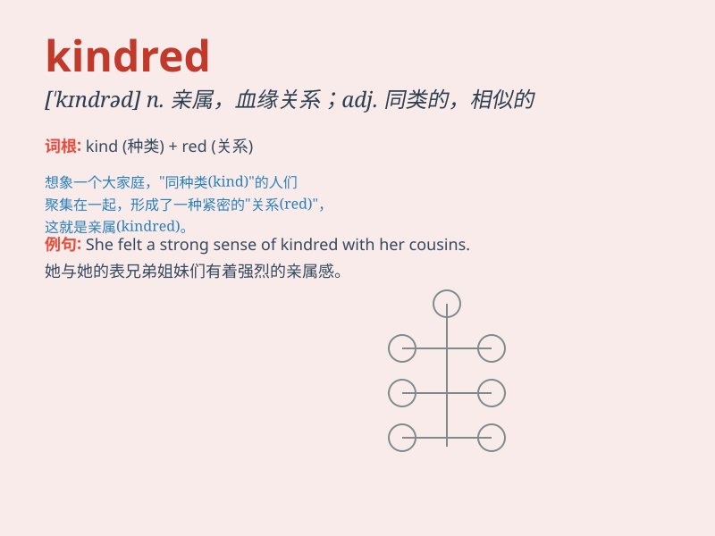

## kindred

**英音:** _[\'kɪndrɪd]_ **美音:** _[\'kɪndrəd]_

**译义:**
*n.家族,相似,亲属关系,(用作复数)亲戚、族人adj.同族的,同类的,血缘的,类似的*

### 短语

+ **kindred spirit:** _志趣相投的人；情投意合的人_

+ **kindred nature:** _相似的性质_

+ **kindred species:** _亲缘物种_

+ **kindred feelings:** _相似的感受_

+ **kindred group:** _同族群体_

### 例句

#### 例句1

> **She felt a kindred spirit with the other artists at the
exhibition.**

**中文翻译:** 她在展览中感觉与其他艺术家意气相投。

**单词释义:** 意气相投的；类似的

#### 例句2

> **My kindred in the countryside always welcome me with open
arms.**

**中文翻译:** 我在乡下的亲属总是热情地欢迎我。

**单词释义:** 亲属；亲戚

#### 例句3

> **They discovered a kindred passion for music and formed a
band.**

**中文翻译:** 他们发现对音乐有着相似的热情，并组建了一个乐队。

**单词释义:** 相似的；类似的

### 背诵小故事

> In a faraway village, there was a big family. They shared love and
care, always helping each other. This family was kindred, meaning they
were related by blood and had a deep connection.

**在一个遥远的村庄，有一个大家庭。他们相互关爱，总是互相帮助。这个家庭是亲属关系的，意味着他们有血缘关系并且联系紧密。**

### 图义

