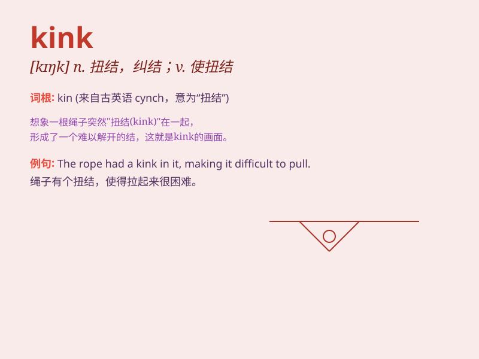

## kink

**英音:** _[kɪŋk]_ **美音:** _[kɪŋk]_

**译义:**
*n.(绳,头发等的纽)结,(道路等的)弯曲,肌肉抽筋v.(使)纠结,(使)纽绞*

### 短语

+ **kink in the hose:** _软管上的扭结_

+ **a kink in the plan:** _计划中的波折_

+ **kink up:** _扭结；缠结_

+ **kink out:** _解开扭结_

+ **mental kink:** _心理怪癖_

### 例句

#### 例句1

> **There\'s a kink in the hose, preventing the water from flowing
smoothly.**

**中文翻译:** 水管有个弯，导致水无法顺畅流动。

**单词释义:** 弯；扭结

#### 例句2

> **The kink in his plan was that he didn\'t have enough money.**

**中文翻译:** 他计划中的缺陷在于他没有足够的钱。

**单词释义:** 缺陷；难题

#### 例句3

> **She tried to smooth out the kink in her hair.**

**中文翻译:** 她试图弄平头发上的扭结。

**单词释义:** （头发等的）扭结

### 背诵小故事

> A little monkey was playing in the forest and got its tail kinked by
a branch. It struggled to straighten it out. Remember, \'kink\' means a
bend or twist in something.

**一只小猴子在森林里玩耍，它的尾巴被一根树枝弄弯了。它努力把尾巴弄直。记住，\'kink\'意思是某物的弯曲或扭曲。**

### 图义

