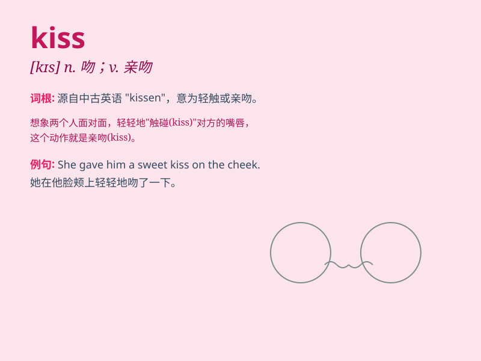

## kiss

**英音:** _[kɪs]_ **美音:** _[kɪs]_

**译义:** *n.吻,(风,浪等)拂vt.吻,轻拂vi.接吻*

### 短语

+ **kiss goodbye:** _吻别；放弃，失去_

+ **kiss of death:** _导致失败或毁灭的事物_

+ **kiss and tell:**
_（通常指为获取利益或出名而）泄露与名人的私情_

+ **kiss up to:** _讨好，奉承_

+ **blow a kiss:** _飞吻_

### 例句

#### 例句1

> **She gave him a kiss on the cheek.**

**中文翻译:** 她在他的脸颊上亲了一下。

**单词释义:** 亲吻

#### 例句2

> **The prince kissed the Sleeping Beauty to wake her up.**

**中文翻译:** 王子亲吻了睡美人把她唤醒。

**单词释义:** 亲吻

#### 例句3

> **He blew a kiss to his girlfriend as she left.**

**中文翻译:** 他的女朋友离开时，他给了她一个飞吻。

**单词释义:** 飞吻

### 背诵小故事

> A prince was lost in a forest. When he felt hopeless, a beautiful
fairy appeared and gave him a kiss. Suddenly, the prince gained strength
and found his way back. The kiss had magical power.

**一位王子在森林中迷路了。当他感到绝望时，一位美丽的仙女出现并给了他一个吻。突然，王子获得了力量并找到了回去的路。这个吻有神奇的力量。**

### 图义

