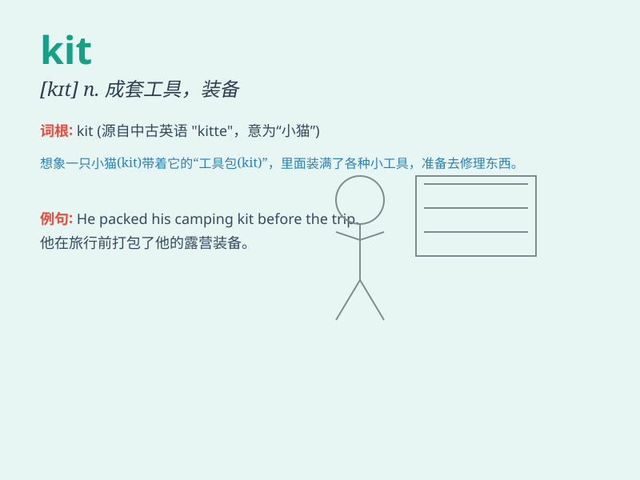

## kit

**英音:** _[kɪt]_ **美音:** _[kɪt]_

**译义:** *n.成套工具,用具包,工具箱,成套用具*

### 短语

+ **tool kit:** _工具包_

+ **first aid kit:** _急救箱_

+ **make-up kit:** _化妆包_

+ **repair kit:** _修理工具包_

+ **drum kit:** _一套鼓乐器_

### 例句

#### 例句1

> **The football player received a new kit before the game.**

**中文翻译:** 这位足球运动员在比赛前收到了一套新的装备。

**单词释义:** 装备；全套衣服及装备

#### 例句2

> **She bought a first-aid kit for emergencies.**

**中文翻译:** 她买了一个急救箱以备不时之需。

**单词释义:** 成套工具；工具箱

#### 例句3

> **The children were excited to assemble the model airplane kit.**

**中文翻译:** 孩子们很兴奋地组装模型飞机套件。

**单词释义:** （配套的）一组物品；一套组件

### 背诵小故事

> A little mouse was very excited because it found a kit full of
treasures. There were shiny jewels and colorful candies. The mouse
happily carried the kit home.

**一只小老鼠非常兴奋，因为它发现了一个装满宝藏的工具包。里面有闪闪发光的珠宝和五颜六色的糖果。老鼠高兴地把工具包搬回了家。**

### 图义

