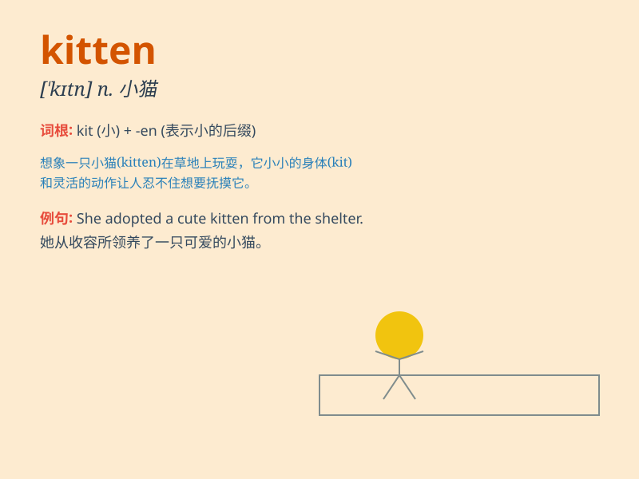

## kitten

**英音:** _[\'kɪt(ə)n]_ **美音:** _[\'kɪtn]_

**译义:** *n.小猫,小动物*

### 短语

+ **kitten heel:** _（女鞋的）低跟_

+ **kitten eyes:** _迷人的眼睛_

+ **playful kitten:** _顽皮的小猫_

+ **lovely kitten:** _可爱的小猫_

+ **tiny kitten:** _小小的猫咪_

### 例句

#### 例句1

> **The kitten is playing with a ball of yarn.**

**中文翻译:** 这只小猫正在玩一团毛线球。

**单词释义:** 小猫

#### 例句2

> **I found a cute kitten in the garden.**

**中文翻译:** 我在花园里发现了一只可爱的小猫。

**单词释义:** 小猫

#### 例句3

> **The little girl held the kitten gently in her arms.**

**中文翻译:** 小女孩轻轻地把小猫抱在怀里。

**单词释义:** 小猫

### 背诵小故事

> One day, a little girl saw a cute kitten playing with a ball of yarn.
The kitten was so tiny and fluffy. It meowed softly as if saying hello.
The girl was charmed by the lovely kitten.

**有一天，一个小女孩看到一只可爱的小猫正在玩一团毛线球。这只小猫非常小而且毛茸茸的。它轻轻地喵喵叫，好像在打招呼。小女孩被这只可爱的小猫迷住了。**

### 图义

