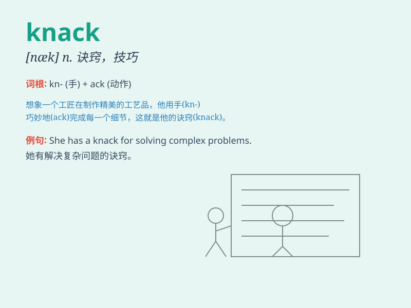

## knack

**英音:** _[næk]_ **美音:** _[næk]_

**译义:** *n.诀窍*

### 短语

+ **have a knack for:** _有......的本领；擅长_

+ **knack of doing sth:** _做某事的诀窍_

+ **acquire a knack:** _获得诀窍_

+ **develop a knack:** _培养技能_

+ **lose one\'s knack:** _失去技能_

### 例句

#### 例句1

> **He has a knack for making people laugh.**

**中文翻译:** 他有一种能让人发笑的本领。

**单词释义:** 本领；技能；诀窍

#### 例句2

> **She has the knack of getting along with difficult people.**

**中文翻译:** 她有与难相处的人相处的诀窍。

**单词释义:** 诀窍；技巧

#### 例句3

> **There\'s a knack to opening this kind of bottle.**

**中文翻译:** 开这种瓶子有个窍门。

**单词释义:** 窍门；技巧

### 背诵小故事

> There was a young man named Tom. He had a knack for finding lost
keys. One day, in a crowded park, he quickly spotted a keychain under a
bench. Everyone was amazed by his special ability.

**有个叫汤姆的年轻人。他有找到丢失钥匙的诀窍。有一天，在一个拥挤的公园，他很快就在长椅下发现了一个钥匙链。大家都对他的特殊能力感到惊讶。**

### 图义

