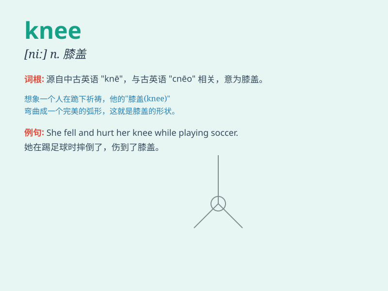

## knee

**英音:** _[niː]_ **美音:** _[ni]_

**译义:** *n.膝,膝盖*

### 短语

+ **knee joint:** _膝关节_

+ **knee pad:** _护膝_

+ **knee-deep:** _深及膝的_

+ **on one\'s knees:** _跪着；屈服_

+ **bend the knee:** _屈膝；屈服_

### 例句

#### 例句1

> **He hurt his knee while playing football.**

**中文翻译:** 他踢足球时伤到了膝盖。

**单词释义:** 膝盖

#### 例句2

> **She knelt down on one knee to propose.**

**中文翻译:** 她单膝跪下求婚。

**单词释义:** 膝盖

#### 例句3

> **The child was sitting on her father\'s knee.**

**中文翻译:** 孩子坐在她父亲的膝上。

**单词释义:** 膝部

### 背诵小故事

> One day, when I was playing football, I accidentally fell and hurt my
knee. It was very painful. But after a period of rest and treatment, my
knee recovered. Remember, knee is the part of our body that bends in the
middle of our leg.

**有一天，我踢足球时不小心摔倒伤到了膝盖。非常疼。但经过一段时间的休息和治疗，我的膝盖恢复了。记住，knee
就是我们腿中间弯曲的那个部位。**

### 图义

