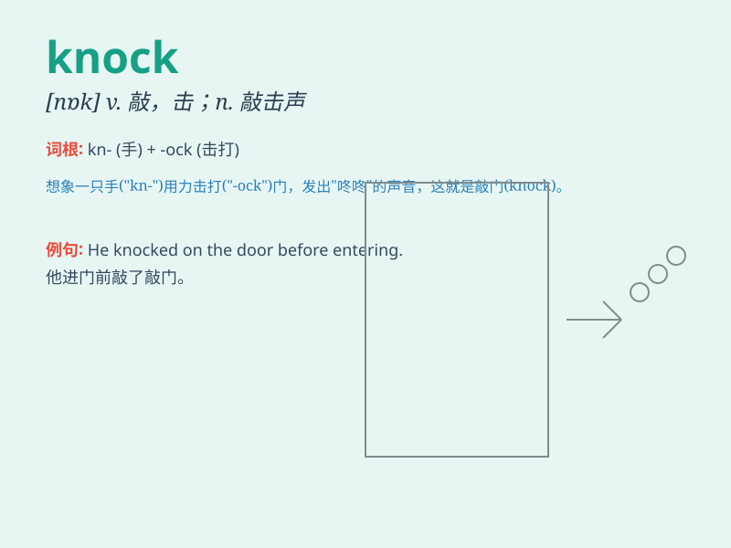

## knock

**英音:** _[nɒk]_ **美音:** _[nɑk]_

**译义:** *v.敲,敲打,敲击,(使)碰撞n.敲,击,敲打*

### 短语

+ **knock at:** _敲（门、窗等）_

+ **knock down:** _撞倒；拆除_

+ **knock off:** _停工；中断；下班；击倒_

+ **knock out:** _使不省人事；淘汰；击败_

+ **knock over:** _打翻；撞倒_

### 例句

#### 例句1

> **Someone is knocking at the door.**

**中文翻译:** 有人正在敲门。

**单词释义:** 敲；击

#### 例句2

> **The wind knocked over the flowerpot.**

**中文翻译:** 风把花盆刮倒了。

**单词释义:** 弄倒；打倒

#### 例句3

> **She knocked the glass off the table by accident.**

**中文翻译:** 她不小心把玻璃杯从桌子上碰掉了。

**单词释义:** 碰；撞

### 背诵小故事

> One night, a thief tried to knock the door of a house. But the owner
was awake and shouted loudly. The thief was scared and ran away.
Remember, \'knock\' means hitting a surface to make a sound.

**一天晚上，一个小偷试图敲门。但主人醒着并大声喊叫。小偷被吓到然后跑掉了。记住，'knock'意思是敲击表面发出声音。**

### 图义

