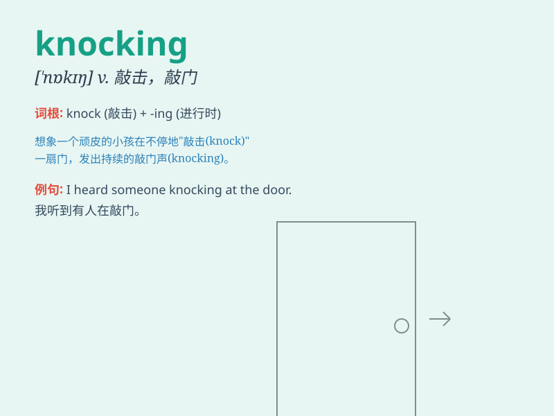

## knocking

**英音:** _[ˈnɒkɪŋ]_ **美音:** _[ˈnɑːkɪŋ]_

**译义:** *n.爆震音,卡答卡答的故障声音*

### 短语

+ **knocking at the door:** _敲门_

+ **knocking sound:** _敲击声_

+ **constant knocking:** _持续的敲击_

+ **loud knocking:** _响亮的敲击_

+ **gentle knocking:** _轻柔的敲击_

### 例句

#### 例句1

> **There was a knocking at the door.**

**中文翻译:** 有敲门声。

**单词释义:** 敲门（的声音）

#### 例句2

> **He heard a knocking on the window.**

**中文翻译:** 他听到窗户上有敲击声。

**单词释义:** 敲击（的声音）

#### 例句3

> **The engine is making a strange knocking sound.**

**中文翻译:** 发动机发出一种奇怪的敲击声。

**单词释义:** （机器等）发出的敲击声

### 背诵小故事

> One night, I was sleeping soundly when suddenly there was a loud
knocking at the door. It woke me up and made my heart race. I wondered
who could be knocking so late at night.

**一天晚上，我正在熟睡，突然传来一阵响亮的敲门声。它把我吵醒了，让我的心跳加速。我想知道这么晚了谁会敲门。**

### 图义

