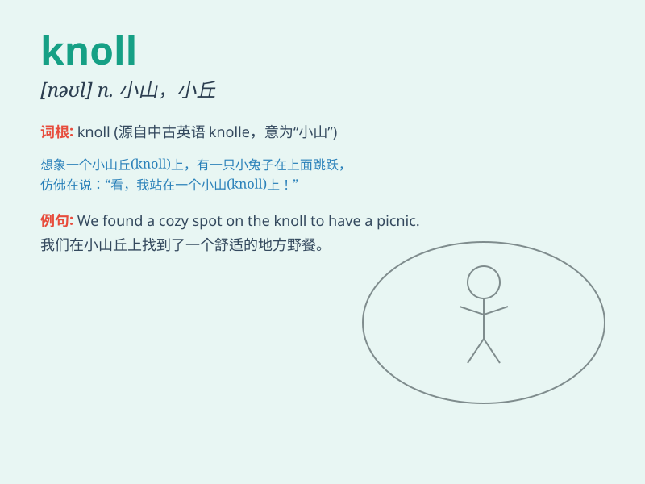

## knoll

**英音:** _[nəʊl]_ **美音:** _[nol]_

**译义:** *n.小山*

### 短语

+ **wooded knoll:** _树木繁茂的小山丘_

+ **grassy knoll:** _长满草的小山丘_

+ **low knoll:** _低矮的小山丘_

+ **isolated knoll:** _孤立的小山丘_

+ **round knoll:** _圆形的小山丘_

### 例句

#### 例句1

> **They sat on a grassy knoll and enjoyed the view.**

**中文翻译:** 他们坐在长满草的小山丘上欣赏风景。

**单词释义:** 小山丘

#### 例句2

> **The sheep were grazing on the knoll.**

**中文翻译:** 羊群在小山丘上吃草。

**单词释义:** 小山丘

#### 例句3

> **From the top of the knoll, one could see for miles.**

**中文翻译:** 从这个小山丘的顶部，可以看到数英里远。

**单词释义:** 小山丘

### 背诵小故事

> A little rabbit was hopping on a sunny day. It climbed up a knoll and
saw a beautiful view. The grass was green and the flowers were blooming.
The knoll was like a small stage for the rabbit to enjoy nature.

**一只小兔子在一个阳光明媚的日子里蹦蹦跳跳。它爬上了一个小山丘，看到了美丽的景色。草是绿的，花在盛开。这个小山丘就像一个小舞台，让兔子享受大自然。**

### 图义

