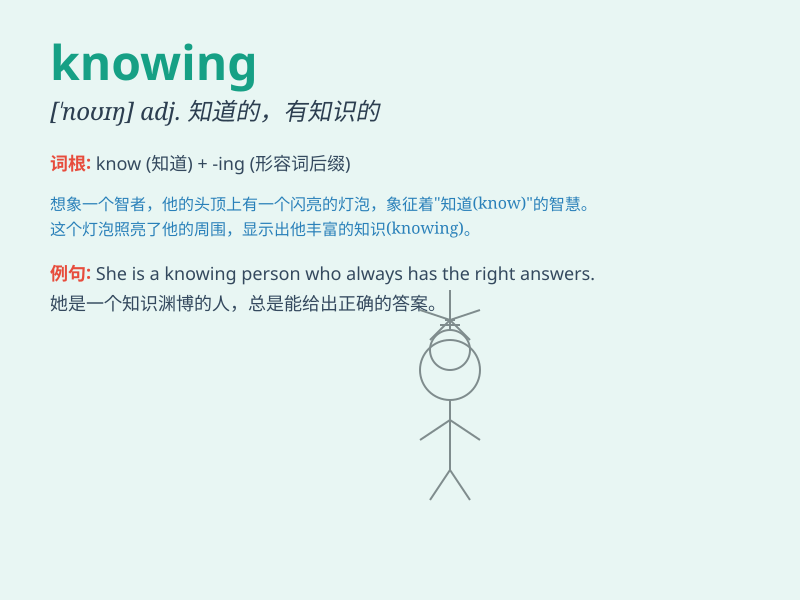

## knowing

**英音:** _[\'nəʊɪŋ]_ **美音:** _[\'noɪŋ]_

**译义:**
*adj.会意的,心照不宣的,聪颖的,精明的,\<贬>世故的,狡猾的*

### 短语

+ **knowing smile:** _会意的微笑_

+ **knowing look:** _会意的眼神_

+ **with a knowing air:** _带着一副自以为是的样子_

+ **knowing wink:** _心领神会的眨眼_

+ **a knowing glance:** _心领神会的一瞥_

### 例句

#### 例句1

> **She gave me a knowing smile when I mentioned the surprise
party.**

**中文翻译:** 当我提到惊喜派对时，她给了我一个心领神会的微笑。

**单词释义:** 心领神会的；会意的

#### 例句2

> **He had a knowing look in his eyes as if he knew all the
secrets.**

**中文翻译:** 他眼中带着一种洞悉一切的神情，仿佛知道所有的秘密。

**单词释义:** 洞悉的；知晓的

#### 例句3

> **The knowing tone of his voice made me suspicious.**

**中文翻译:** 他说话那自信的语气让我起了疑心。

**单词释义:** 自信的；胸有成竹的

### 背诵小故事

> A little boy was lost in the forest. But he was knowing and
remembered the way his father taught him to find the north star. With
this knowledge, he finally found his way home safely.

**一个小男孩在森林里迷路了。但他很机灵，记得父亲教他如何找到北极星。凭借这个知识，他最终安全地找到了回家的路。**

### 图义

