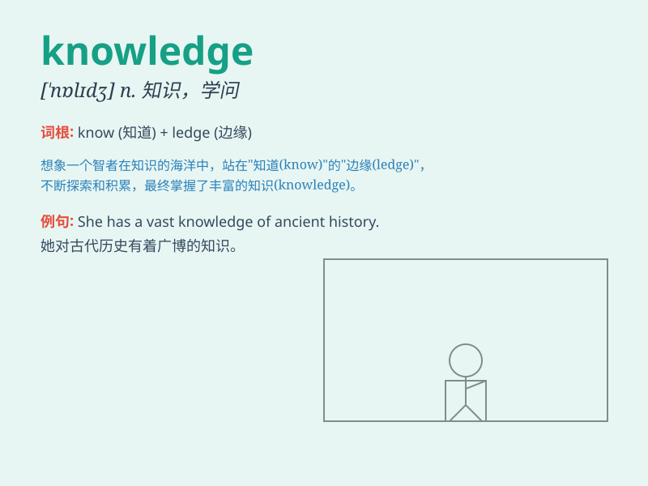

## knowledge

**英音:** _[\'nɒlɪdʒ]_ **美音:** _[\'nɑlɪdʒ]_

**译义:** *n.知识,学问,认识,知道,\<古>学科*

### 短语

+ **common knowledge:** _常识；众所周知的事_

+ **technical knowledge:** _技术知识_

+ **practical knowledge:** _实用知识_

+ **general knowledge:** _常识；一般知识_

+ **scientific knowledge:** _科学知识_

### 例句

#### 例句1

> **She has extensive knowledge of history.**

**中文翻译:** 她有广博的历史知识。

**单词释义:** 知识；学问

#### 例句2

> **The book is a valuable source of knowledge.**

**中文翻译:** 这本书是知识的宝贵来源。

**单词释义:** 知识；学识

#### 例句3

> **His knowledge of the language helped him get the job.**

**中文翻译:** 他对这门语言的了解帮助他得到了这份工作。

**单词释义:** 了解；知晓

### 背诵小故事

> One day, a little boy was lost in a big forest. But with his
knowledge of directions and survival skills, he found his way home.
Knowledge is like a guiding light in the darkness.

**有一天，一个小男孩在大森林里迷路了。但凭借他对方向和生存技能的知识，他找到了回家的路。知识就像黑暗中的指路明灯。**

### 图义

