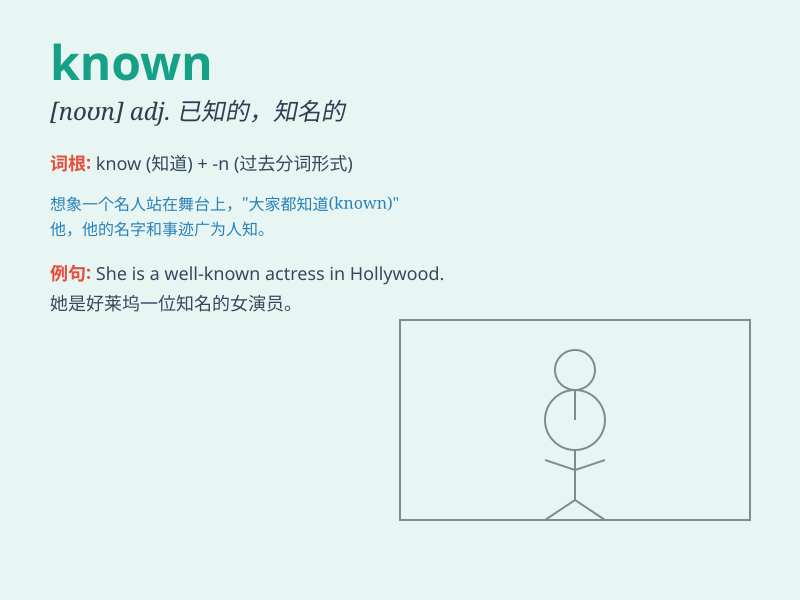

## known

**英音:** _[nəʊn]_ **美音:** _[non]_

**译义:** *adj.知名的,大家知道的 vbl.know的过去分词*

### 短语

+ **be known as:** _被称为；被认为是_

+ **be known for:** _因\...\...而闻名_

+ **make oneself known:** _自我介绍；使自己被知晓_

+ **known quantity:** _已知量；熟知的人或事物_

+ **well-known:** _出名的；众所周知的_

### 例句

#### 例句1

> **He is a well-known actor.**

**中文翻译:** 他是一位著名的演员。

**单词释义:** 著名的；众所周知的

#### 例句2

> **The cause of the accident is not yet known.**

**中文翻译:** 事故的原因尚未知晓。

**单词释义:** 知道；了解；清楚

#### 例句3

> **This area is known for its beautiful scenery.**

**中文翻译:** 这个地区以其美丽的风景而闻名。

**单词释义:** 闻名；出名

### 背诵小故事

> A brave explorer was lost in a mysterious forest. But he was known
for his excellent survival skills. Finally, he found his way out. People
knew he would succeed because of his reputation.

**一位勇敢的探险家在神秘森林中迷路了。但他以出色的生存技能而闻名。最终，他找到了出路。人们知道他会成功，因为他的名声。**

### 图义

