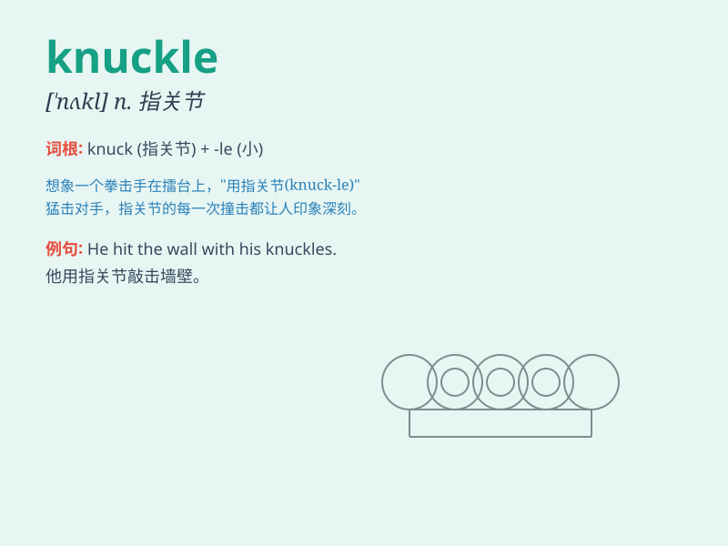

## knuckle

**英音:** _[\'nʌk(ə)l]_ **美音:** _[\'nʌkl]_

**译义:** *n.指节,关节*

### 短语

+ **knuckle down:** _开始认真工作；全力以赴_

+ **knuckle under:** _屈服；认输_

+ **knuckle joint:** _指关节；铰链接合_

+ **white knuckle:** _令人极度紧张的；引起恐慌的_

+ **knuckle sandwich:** _（用拳头）猛击_

### 例句

#### 例句1

> **He cracked his knuckles nervously before the exam.**

**中文翻译:** 在考试前，他紧张地把指关节弄响。

**单词释义:** 指关节

#### 例句2

> **You need to knuckle down and study if you want to pass the
test.**

**中文翻译:** 如果你想通过测试，你就得努力学习。

**单词释义:** 努力工作；开始认真做事

#### 例句3

> **The boxer hit his opponent on the knuckle.**

**中文翻译:** 这位拳击手打到了对手的指关节上。

**单词释义:** 指关节

### 背诵小故事

> A brave knight was fighting a dragon. The dragon bit his hand, but
the knight hit the dragon\'s head with his knuckle. With great strength,
he won the battle. Remember, a knuckle is the joint of a finger!

**一位勇敢的骑士正在和一条龙战斗。龙咬了他的手，但骑士用指关节击打龙的头。凭借巨大的力量，他赢得了战斗。记住，指关节就是手指的关节！**

### 图义

