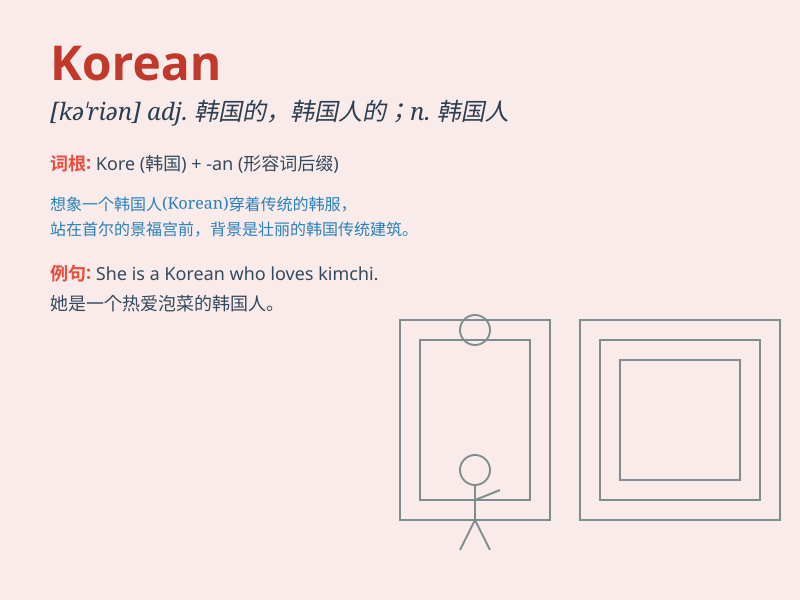

## Korean

**英音:** _[ˈkɔːrɪən]_ **美音:** _[ˈkɔːrɪən]_

**译义:** *n. 韩国语；韩裔居民

adj. 韩国的；韩国人的；韩国语的*

### 短语

+ **Korean War:** _朝鲜战争_

+ **Korean Peninsula:** _朝鲜半岛_

+ **Korean cuisine:** _韩国料理_

+ **Korean language:** _朝鲜语；韩语_

+ **Korean culture:** _韩国文化；朝鲜文化_

### 例句

#### 例句1

> **She is learning Korean because she wants to visit South
Korea.**

**中文翻译:** 她正在学习韩语，因为她想去韩国旅游。

**单词释义:** 韩语

#### 例句2

> **The Korean restaurant near my house serves delicious food.**

**中文翻译:** 我家附近的那家韩国餐馆提供美味的食物。

**单词释义:** 韩国的

#### 例句3

> **Korean culture is very unique and charming.**

**中文翻译:** 韩国文化非常独特和迷人。

**单词释义:** 韩国的

### 背诵小故事

> One day, I met a friendly person named Kim. He told me he was Korean
and showed me beautiful pictures of Korea. He also shared delicious
Korean food. Now, whenever I think of \'Korean\', I remember Kim and his
wonderful stories.

**有一天，我遇到了一个友好的人叫金。他告诉我他是韩国人，并给我展示了韩国美丽的图片。他还分享了美味的韩国食物。现在，每当我想到"韩国人；韩语；韩国的；朝鲜的；朝鲜人；朝鲜语"这个单词，我就会想起金和他精彩的故事。**

### 图义

