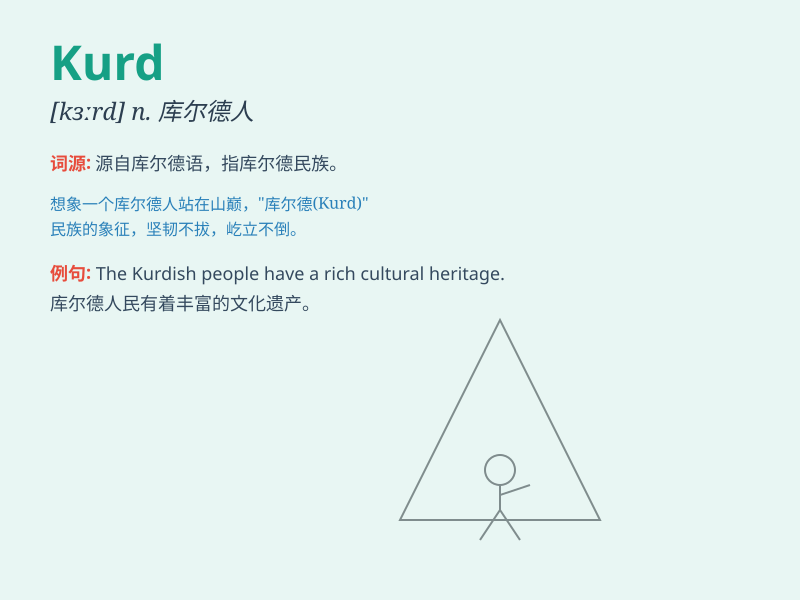

## Kurd

**英音:** _[kɜːd]_ **美音:** _[kɜːrd]_

**译义:** *n.库尔德人*

### 短语

+ **Kurdish people:** _库尔德人_

+ **Kurdish language:** _库尔德语_

+ **Kurdish region:** _库尔德地区_

+ **Kurdish culture:** _库尔德文化_

+ **Kurdish identity:** _库尔德身份_

### 例句

#### 例句1

> **The Kurds have a distinct culture and language.**

**中文翻译:** 库尔德人有着独特的文化和语言。

**单词释义:** 库尔德人

#### 例句2

> **Many Kurds are fighting for their rights and autonomy.**

**中文翻译:** 许多库尔德人正在为他们的权利和自治而战。

**单词释义:** 库尔德人

#### 例句3

> **The situation of the Kurds in the region is complex and
challenging.**

**中文翻译:** 该地区库尔德人的情况复杂且具有挑战性。

**单词释义:** 库尔德人

### 背诵小故事

> 想象一下，在一个遥远的地方，有一群勇敢的人叫做
Kurds。他们生活在大山之中，坚守着自己的传统和家园。他们的服饰独特，笑容灿烂，Kurds
这个词就代表着他们勇敢和团结的精神。

**想象一下，在一个遥远之地，有一群叫库尔德人的勇敢群体。他们居于大山里，坚守传统与家园。其服饰独特，笑容灿烂，"Kurd"这个词象征着他们的勇敢团结精神。**

### 图义

