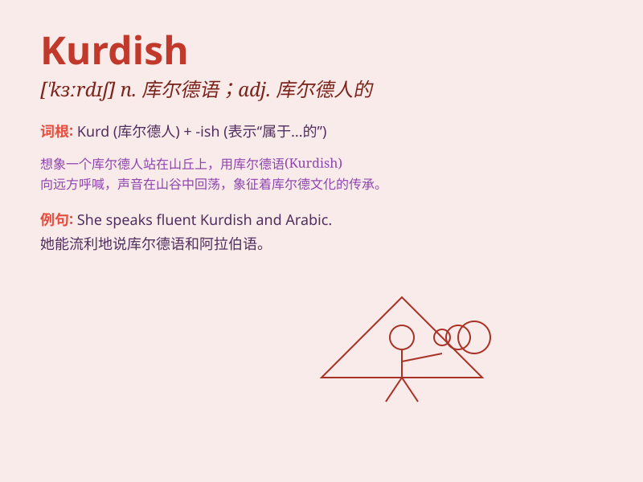

## Kurdish

**英音:** _[ˈkɜːdɪʃ]_ **美音:** _[ˈkɜːrdɪʃ]_

**译义:** *adj.库尔德人的；库尔德语的；库尔德文化的 n.库尔德语*

### 短语

+ **Kurdish language:** _库尔德语_

+ **Kurdish people:** _库尔德人_

+ **Kurdish region:** _库尔德地区_

+ **Kurdish culture:** _库尔德文化_

+ **Kurdish cuisine:** _库尔德美食_

### 例句

#### 例句1

> **The Kurdish people have a rich cultural heritage.**

**中文翻译:** 库尔德人拥有丰富的文化遗产。

**单词释义:** 库尔德人的；库尔德语的

#### 例句2

> **She is studying Kurdish language and history.**

**中文翻译:** 她正在学习库尔德语和库尔德历史。

**单词释义:** 库尔德人的；库尔德语的

#### 例句3

> **The Kurdish region has beautiful landscapes.**

**中文翻译:** 库尔德地区有美丽的风景。

**单词释义:** 库尔德人的；库尔德地区的

### 背诵小故事

> A Kurdish boy named Ali was proud of his cultural heritage. He wore
traditional Kurdish clothes and danced to Kurdish music. His love for
everything Kurdish made him want to share it with the world.

**一个叫阿里的库尔德男孩为他的文化遗产感到骄傲。他穿着传统的库尔德服装，随着库尔德音乐跳舞。他对所有库尔德事物的热爱让他想与世界分享。**

### 图义

