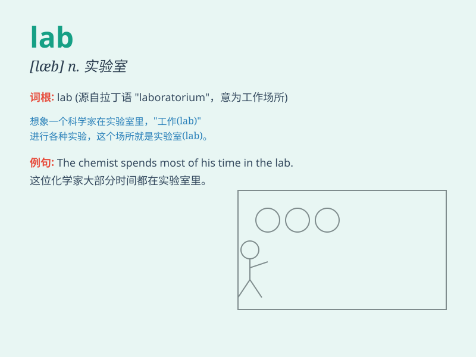

## lab

**英音:** _[læb]_ **美音:** _[læb]_

**译义:** *n.实验室,研究室*

### 短语

+ **lab report:** _实验报告_

+ **lab assistant:** _实验室助理_

+ **lab coat:** _实验服；实验室工作服_

+ **lab equipment:** _实验室设备_

+ **language lab:** _语言实验室_

### 例句

#### 例句1

> **The scientist spent hours in the lab conducting experiments.**

**中文翻译:** 这位科学家在实验室里花了几个小时做实验。

**单词释义:** 实验室

#### 例句2

> **She is working in a chemistry lab.**

**中文翻译:** 她在一个化学实验室工作。

**单词释义:** 实验室

#### 例句3

> **The new computer lab is equipped with the latest technology.**

**中文翻译:** 新的计算机实验室配备了最新的技术。

**单词释义:** 实验室

### 背诵小故事

> In a secret room of a big building, there was a special place called
\'lab\'. Scientists in white coats were busy doing experiments there.
They were trying to discover new things. The \'lab\' was full of strange
tools and colorful liquids.

**在一座大建筑的一个秘密房间里，有一个特殊的地方叫做'实验室'。穿着白大褂的科学家们在那里忙着做实验。他们试图发现新事物。这个'实验室'里摆满了奇怪的工具和五颜六色的液体。**

### 图义

