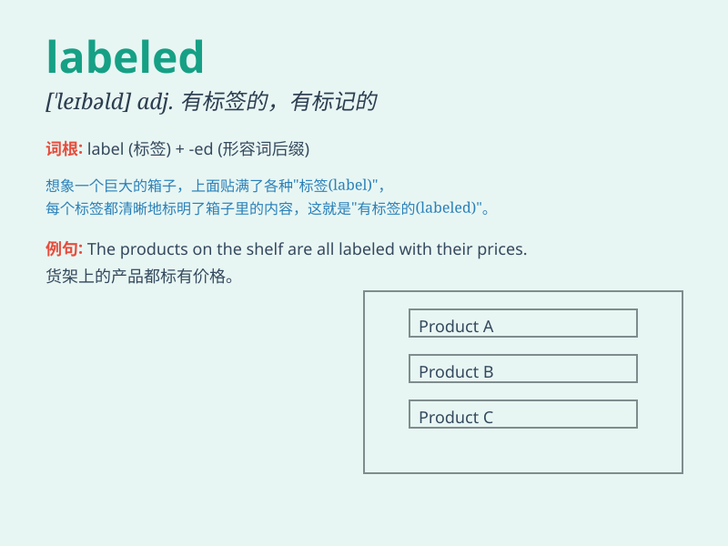

## labeled

**英音:** _[ˈleɪbld]_ **美音:** _[ˈleɪbld]_

**译义:** *标记过的；贴上标签的（label的过去式及过去分词形式）*

### 短语

+ **be labeled as:** _被标记为；被称为_

+ **labeled container:** _有标签的容器_

+ **labeled price:** _标价_

+ **labeled sample:** _有标签的样本_

+ **clearly labeled:** _清晰标注的_

### 例句

#### 例句1

> **The package was labeled \'Fragile\'.**

**中文翻译:** 这个包裹被标上了\'易碎\'的标签。

**单词释义:** 被标注；被贴上标签

#### 例句2

> **The bottles are labeled with different colors.**

**中文翻译:** 这些瓶子用不同的颜色做了标记。

**单词释义:** 被标记；被贴上

#### 例句3

> **The documents were wrongly labeled.**

**中文翻译:** 这些文件被错误地贴上了标签。

**单词释义:** 被贴上标签；被标注

### 背诵小故事

> One day, Tom found a box labeled \'Treasure\'. He was so excited but
couldn\'t open it. Later, he realized it was just a prank. The label was
misleading.

**有一天，汤姆发现了一个标有\'宝藏\'的盒子。他非常兴奋但打不开。后来，他意识到这只是个恶作剧。这个标签具有误导性。**

### 图义

