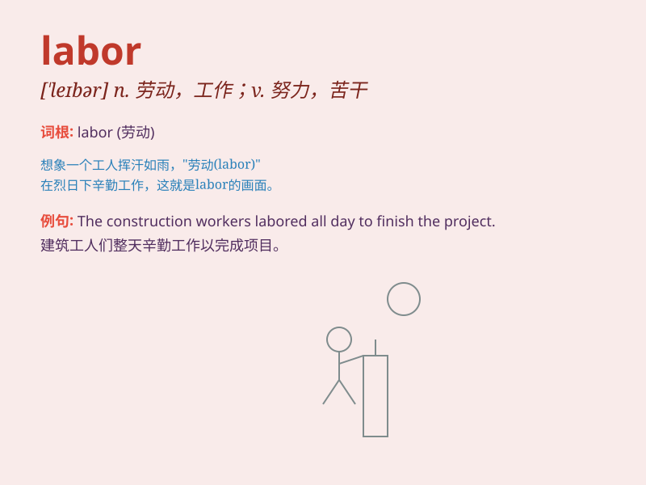

## labor

**英音:** _[\'leɪbə(r)]_ **美音:** _[\'lebɚ]_

**译义:**
*n.劳动,努力,工作,劳工,分娩,阵痛vi.劳动,努力争取(for),苦干vt.详细分析,麻烦*

### 短语

+ **labor force:** _劳动力_

+ **manual labor:** _体力劳动_

+ **labor market:** _劳动力市场_

+ **labor pain:** _分娩时的阵痛_

+ **labor union:** _工会_

### 例句

#### 例句1

> **The construction workers are engaged in hard labor.**

**中文翻译:** 建筑工人从事着艰苦的劳动。

**单词释义:** 劳动；工作

#### 例句2

> **She went into labor early this morning.**

**中文翻译:** 她今天清晨开始分娩。

**单词释义:** 分娩；生产

#### 例句3

> **The new law will reduce the labor costs for businesses.**

**中文翻译:** 新法律将降低企业的劳动力成本。

**单词释义:** 劳动力

### 背诵小故事

> A hardworking ant was always in labor. It carried food, built its
home, and never stopped. Just like us when we work hard, this is what
\'labor\' means - hard work and effort.

**一只勤劳的蚂蚁总是在劳作。它搬运食物、建造家园，从未停歇。就像我们努力工作时一样，这就是'labor'的意思------辛苦的工作和努力。**

### 图义

