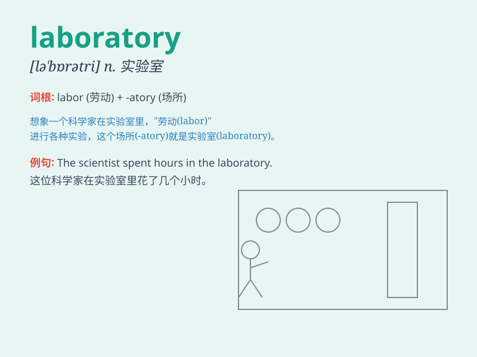

## laboratory

**英音:** _[ləˈbɒrətrɪ]_ **美音:** _[ˈlæbrəˌtɔrɪ]_

**译义:** *n.实验室*

### 短语

+ **laboratory experiment:** _实验室实验_

+ **research laboratory:** _研究实验室_

+ **chemical laboratory:** _化学实验室_

+ **laboratory equipment:** _实验室设备_

+ **laboratory assistant:** _实验室助理_

### 例句

#### 例句1

> **The scientists are conducting experiments in the laboratory.**

**中文翻译:** 科学家们正在实验室里做实验。

**单词释义:** 实验室

#### 例句2

> **Our school has a well-equipped laboratory for chemistry
experiments.**

**中文翻译:** 我们学校有一个设备齐全的化学实验实验室。

**单词释义:** 实验室

#### 例句3

> **She spent the whole day in the laboratory analyzing the data.**

**中文翻译:** 她在实验室里花了一整天分析数据。

**单词释义:** 实验室

### 背诵小故事

> A scientist was working hard in the laboratory. He spent days and
nights doing experiments, surrounded by test tubes and advanced
equipment. His dedication led to a great discovery.

**一位科学家在实验室里努力工作。他日夜不停地做实验，周围都是试管和先进的设备。他的专注促成了一项重大发现。**

### 图义

