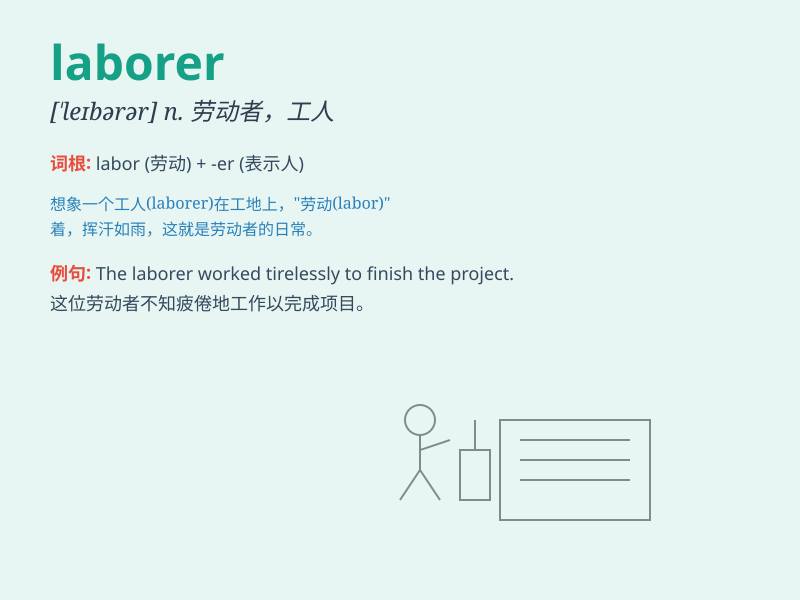

## laborer

**英音:** _[\'leɪbərə]_ **美音:** _[\'lebərɚ]_

**译义:** *n.劳动者(尤指体力劳动者),壮工*

### 短语

+ **manual laborer:** _体力劳动者_

+ **skilled laborer:** _熟练工人_

+ **unskilled laborer:** _非熟练工人_

+ **construction laborer:** _建筑工人_

+ **farm laborer:** _农场工人_

### 例句

#### 例句1

> **The laborer worked hard in the construction site all day.**

**中文翻译:** 这个工人一整天都在建筑工地上努力工作。

**单词释义:** 工人

#### 例句2

> **The company hired several laborers to handle the heavy
workload.**

**中文翻译:** 公司雇佣了几个工人来处理繁重的工作量。

**单词释义:** 工人

#### 例句3

> **The poor laborer struggled to make ends meet.**

**中文翻译:** 这个可怜的工人努力维持生计。

**单词释义:** 工人

### 背诵小故事

> One day, a poor laborer named Tom was working hard on a construction
site. He carried heavy bricks all day long, sweating and tired, but he
kept going to earn a living for his family.

**一天，一个叫汤姆的穷苦劳动者在建筑工地上努力工作。他一整天都搬运着重砖块，汗流浃背且疲惫不堪，但为了家人的生计他一直坚持着。**

### 图义

