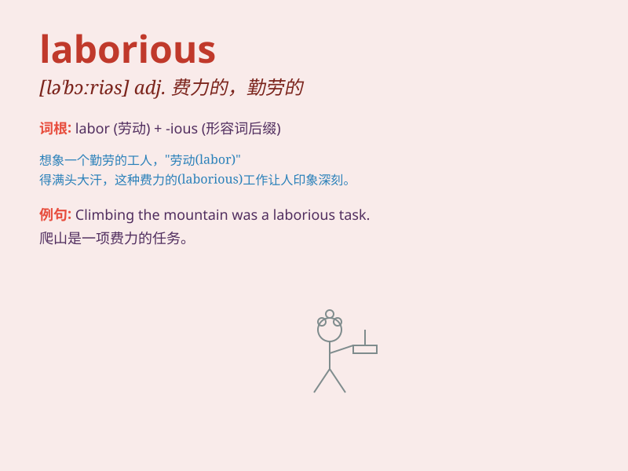

## laborious

**英音:** _[lə\'bɔːrɪəs]_ **美音:** _[lə\'bɔrɪəs]_

**译义:** *adj.(指工作)艰苦的,费力的,(指人)勤劳的*

### 短语

+ **laborious work:** _费力的工作_

+ **laborious task:** _艰巨的任务_

+ **laborious journey:** _艰辛的旅程_

+ **laborious process:** _费力的过程_

+ **laborious effort:** _艰苦的努力_

### 例句

#### 例句1

> **Digging the garden was a laborious task.**

**中文翻译:** 在花园里挖土是一项费力的任务。

**单词释义:** 费力的；辛苦的

#### 例句2

> **The laborious journey through the mountains exhausted us.**

**中文翻译:** 穿越山区的艰难旅程使我们筋疲力尽。

**单词释义:** 艰难的；费力的

#### 例句3

> **She made a laborious effort to finish the project on time.**

**中文翻译:** 她付出了艰苦的努力按时完成这个项目。

**单词释义:** 艰苦的；费力的

### 背诵小故事

> A little ant was carrying a huge leaf. The way was full of obstacles.
It was a laborious task, but the ant didn\'t give up. Finally, it
reached the nest. Remember, \'laborious\' means involving a lot of
effort and hard work, just like the ant\'s journey.

**一只小蚂蚁正驮着一片巨大的叶子。道路充满了障碍。这是一项艰巨的任务，但蚂蚁没有放弃。最后，它到达了巢穴。记住，\'laborious\'意思是费力的，艰苦的，就像蚂蚁的旅程。**

### 图义

