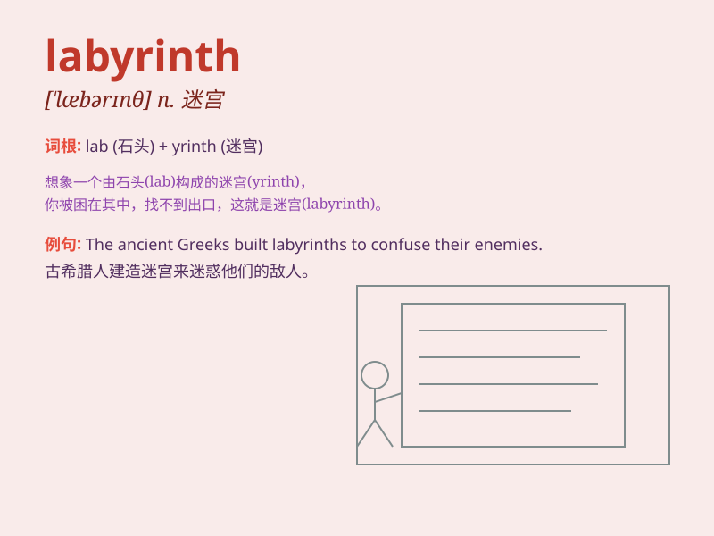

## labyrinth

**英音:** _[\'læb(ə)rɪnθ]_ **美音:** _[\'læbərɪnθ]_

**译义:** *n.迷路,迷宫,难解的事物*

### 短语

+ **labyrinth of streets:** _迷宫般的街道_

+ **navigate the labyrinth:** _在迷宫中导航_

+ **maze-like labyrinth:** _像迷宫一样的迷宫_

+ **entangle in a labyrinth:** _陷入迷宫_

+ **complex labyrinth:** _复杂的迷宫_

### 例句

#### 例句1

> **The old castle was surrounded by a labyrinth of secret
passages.**

**中文翻译:** 这座古老的城堡被一个由秘密通道组成的迷宫所环绕。

**单词释义:** 迷宫；错综复杂的事物

#### 例句2

> **She found herself lost in the labyrinth of the city\'s
streets.**

**中文翻译:** 她发现自己迷失在城市街道的迷宫中。

**单词释义:** 迷宫；错综复杂的道路

#### 例句3

> **His mind was a labyrinth of complex thoughts.**

**中文翻译:** 他的头脑是一个充满复杂想法的迷宫。

**单词释义:** 复杂难懂的事物

### 背诵小故事

> A brave adventurer was lost in a labyrinth. There were many confusing
paths and dead ends. But with determination, he found the exit by
remembering the pattern of the walls. The labyrinth was a tricky maze!

**一位勇敢的探险家在一个迷宫里迷路了。里面有许多令人困惑的路径和死胡同。但凭借决心，他通过记住墙壁的图案找到了出口。这个迷宫真是个棘手的迷阵！**

### 图义

