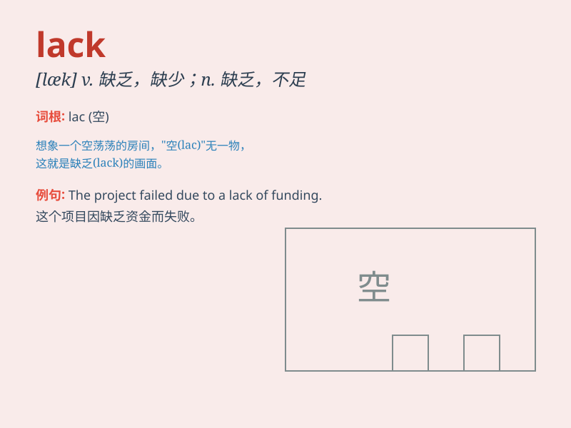

## lack

**英音:** _[læk]_ **美音:** _[læk]_

**译义:** *n.缺乏,短缺的东西vt.缺乏,没有,需要vi.缺乏,没有*

### 短语

+ **lack of:** _缺乏；缺少_

+ **for lack of:** _因缺乏_

+ **be lacking in:** _在\...\...方面缺乏_

+ **no lack of:** _不缺乏；很多_

+ **lack for nothing:** _什么也不缺_

### 例句

#### 例句1

> **He lacks confidence when speaking in public.**

**中文翻译:** 他在公众面前讲话时缺乏自信。

**单词释义:** 缺乏

#### 例句2

> **The project lacks necessary funds.**

**中文翻译:** 这个项目缺少必要的资金。

**单词释义:** 缺少

#### 例句3

> **She lacks the skills needed for the job.**

**中文翻译:** 她缺乏这份工作所需的技能。

**单词释义:** 缺乏

### 背诵小故事

> Once upon a time, a poor farmer always felt sad. Because his fields
lacked good seeds and fertilizers. But later, with help, he got what he
needed and had a bountiful harvest.

**从前，有个贫穷的农民总是很伤心。因为他的田地缺乏好的种子和肥料。但后来，在帮助下，他得到了所需的东西，有了丰收。**

### 图义

