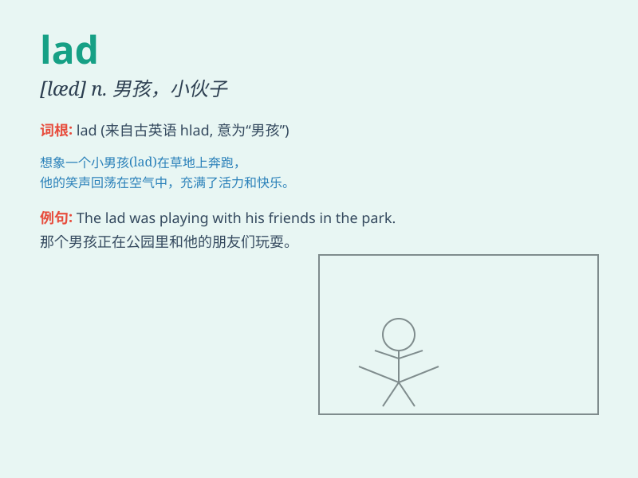

## lad

**英音:** _[læd]_ **美音:** _[læd]_

**译义:** *n.少年,青年男子,\<口>伙计,家伙(呢称)*

### 短语

+ **young lad:** _年轻的小伙子_

+ **clever lad:** _聪明的小伙子_

+ **lucky lad:** _幸运的小伙子_

+ **fine lad:** _优秀的小伙子_

+ **naughty lad:** _顽皮的小伙子_

### 例句

#### 例句1

> **The lad is very smart and hardworking.**

**中文翻译:** 这个少年非常聪明和勤奋。

**单词释义:** 少年；小伙子

#### 例句2

> **He\'s a nice lad and always ready to help.**

**中文翻译:** 他是个好小伙，总是乐于助人。

**单词释义:** 小伙子

#### 例句3

> **The lads were playing football in the park.**

**中文翻译:** 这些小伙子们正在公园里踢足球。

**单词释义:** 小伙子们

### 背诵小故事

> A lad named Tom was always very active. One day, he climbed a tall
tree to get a bird\'s egg but got stuck. His friends had to help him
down. Remember, \'lad\' is a young boy.

**一个叫汤姆的少年总是非常活跃。有一天，他爬上一棵大树去拿鸟蛋却被困住了。他的朋友们不得不把他弄下来。记住，'lad'就是年轻男孩的意思。**

### 图义

