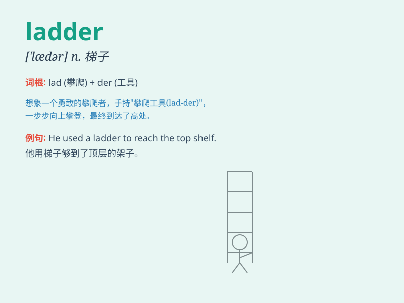

## ladder

**英音:** _[\'lædə]_ **美音:** _[\'lædɚ]_

**译义:** *n.梯子,阶梯vi.袜子抽丝,装设梯子*

### 短语

+ **career ladder:** _职业阶梯_

+ **climb the ladder:** _爬上梯子；晋升_

+ **ladder of success:** _成功的阶梯_

+ **corporate ladder:** _公司晋升阶梯_

+ **rope ladder:** _绳梯_

### 例句

#### 例句1

> **He climbed up the ladder to reach the roof.**

**中文翻译:** 他爬上梯子去够屋顶。

**单词释义:** 梯子

#### 例句2

> **The firefighter used a ladder to rescue the people from the
burning building.**

**中文翻译:** 消防员用梯子从着火的大楼里救人。

**单词释义:** 梯子

#### 例句3

> **She is trying to climb the career ladder.**

**中文翻译:** 她正在努力攀登职业阶梯。

**单词释义:** 阶梯；晋升的途径

### 背诵小故事

> A brave firefighter was climbing a ladder to rescue a cat stuck on a
roof. The ladder was his tool to reach the scared cat safely. With each
step up the ladder, he got closer to the rescue.

**一位勇敢的消防员正在爬梯子去救一只被困在屋顶的猫。梯子是他安全接近猫咪的工具。每爬上梯子一步，他就离救援更近一步。**

### 图义

