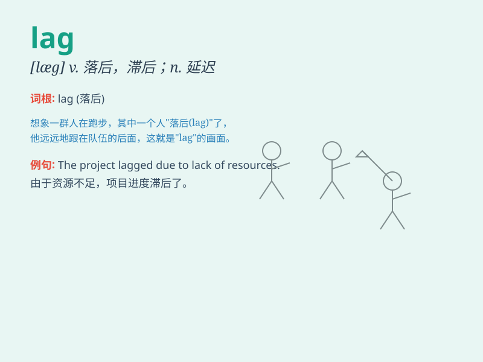

## lag

**英音:** _[læg]_ **美音:** _[læɡ]_

**译义:**
*n.落后,囚犯,迟延,桶板,防护套adj.最后的vi.缓缓而行,滞后vt.落后于,押往监狱,加上外套*

### 短语

+ **time lag:** _时间间隔；时间滞差_

+ **lag behind:** _落后；滞后_

+ **jet lag:** _时差；飞行时差反应_

+ **lag phase:** _（生长）迟缓期；延迟期_

+ **thermal lag:** _热滞后；热惰性_

### 例句

#### 例句1

> **The progress of the project is lagging behind schedule.**

**中文翻译:** 这个项目的进展落后于计划。

**单词释义:** 落后

#### 例句2

> **There is a time lag between the sending and receiving of
emails.**

**中文翻译:** 发送和接收电子邮件之间存在时间差。

**单词释义:** 时间差；滞后

#### 例句3

> **The older children tend to lag behind in the race.**

**中文翻译:** 年龄较大的孩子在比赛中往往落后。

**单词释义:** 落后；掉队

### 背诵小故事

>
想象一只兔子和一只乌龟赛跑，兔子跑得很快，但它中途偷懒睡了一觉。乌龟一直坚持前进，兔子醒来发现乌龟已经领先了很多。兔子的速度在这里就'lag'了，最终乌龟赢得比赛。

**想象一只兔子和一只乌龟赛跑，兔子中途偷懒睡觉导致速度落后。这里的'lag'就是落后、滞后的意思，最终乌龟赢得比赛。**

### 图义

