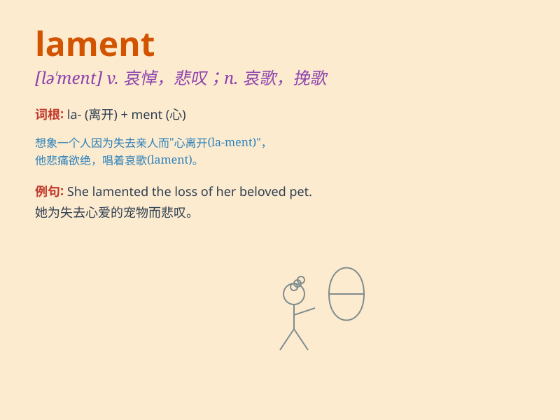

## lament

**英音:** _[lə\'ment]_ **美音:** _[lə\'mɛnt]_

**译义:** *n.悲伤,哀悼,恸哭,挽诗,悼词vt.哀悼vi.悔恨,悲叹*

### 短语

+ **lament over:** _为\...\...而悲痛_

+ **lament for:** _为\...\...哀悼_

+ **lament loudly:** _大声哀悼_

+ **lament bitterly:** _痛苦地悲叹_

+ **lament constantly:** _不断地哀悼_

### 例句

#### 例句1

> **She lamented the loss of her childhood innocence.**

**中文翻译:** 她为失去童年的纯真而感到悲哀。

**单词释义:** 为\...\...感到悲哀；痛惜

#### 例句2

> **The poet lamented the passing of a great era.**

**中文翻译:** 这位诗人为一个伟大时代的逝去而哀叹。

**单词释义:** 哀叹；悲叹

#### 例句3

> **He lamented his decision to quit the job.**

**中文翻译:** 他为自己辞职的决定感到懊悔。

**单词释义:** 懊悔；悔恨

### 背诵小故事

> A poet was deeply moved by the war. He saw the pain and loss, and
composed a song to lament. The song expressed his sadness and longing
for peace. People heard it and understood the meaning of lament.

**一位诗人被战争深深触动。他目睹了痛苦和损失，创作了一首歌来哀悼。这首歌表达了他的悲伤以及对和平的渴望。人们听到后理解了lament的意思。**

### 图义

