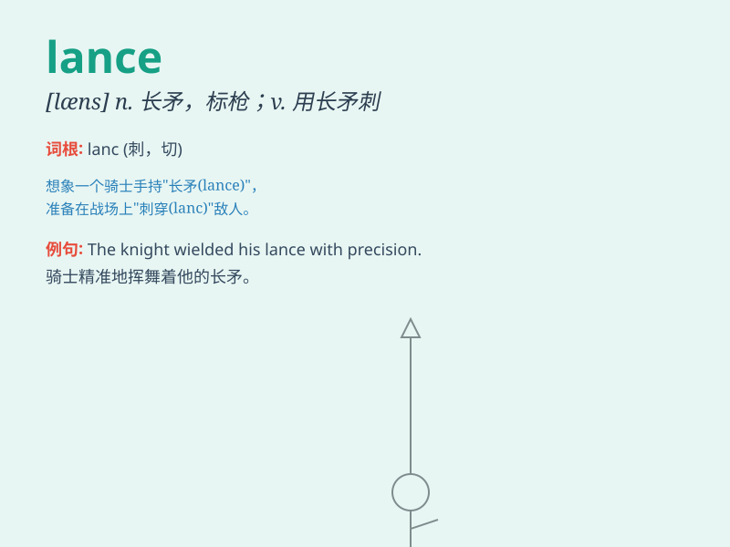

## lance

**英音:** _[lɑːns]_ **美音:** _[læns]_

**译义:** *n.标枪,长矛,矛状器具,捕鲸枪v.切开*

### 短语

+ **lance corporal:** _（英国陆军或海军陆战队的）一等兵_

+ **lance wound:** _矛伤；枪伤_

+ **lanceolate leaf:** _披针形叶_

+ **lance-shaped:** _长矛形状的；披针形的_

+ **lance the boil:** _切开脓肿_

### 例句

#### 例句1

> **The knight brandished his lance and charged into battle.**

**中文翻译:** 这位骑士挥舞着他的长矛，冲入了战斗。

**单词释义:** 长矛

#### 例句2

> **The doctor used a lance to drain the abscess.**

**中文翻译:** 医生用柳叶刀切开脓肿排脓。

**单词释义:** 柳叶刀

#### 例句3

> **He broke the lance of his opponent in the joust.**

**中文翻译:** 在马上长枪比武中，他折断了对手的长矛。

**单词释义:** 长矛

### 背诵小故事

> A brave knight held a lance and charged towards the enemy. The lance
was sharp and shiny, ready to strike. With one powerful thrust, the
knight defeated the foes. Remember, lance is a long weapon used in
battles.

**一位勇敢的骑士手持长矛冲向敌人。长矛锋利且闪耀，准备出击。骑士猛地一刺，击败了敌人。记住，lance
是战斗中使用的长武器。**

### 图义

