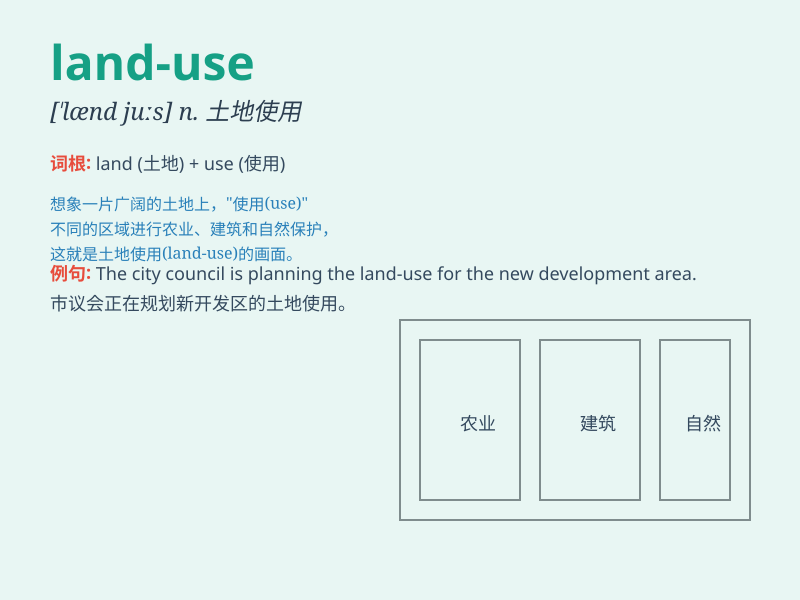

## land-use

**英音:** _[lænd juːs]_ **美音:** _[lænd juːs]_

**译义:** *n.土地利用;土地使用*

### 短语

+ **land-use planning:** _土地利用规划_

+ **land-use pattern:** _土地利用模式_

+ **land-use change:** _土地利用变化_

+ **land-use policy:** _土地利用政策_

+ **land-use classification:** _土地利用分类_

### 例句

#### 例句1

> **The government is working on new policies for land-use
planning.**

**中文翻译:** 政府正在制定关于土地使用规划的新政策。

**单词释义:** 土地使用

#### 例句2

> **Sustainable land-use is crucial for environmental protection.**

**中文翻译:** 可持续的土地使用对于环境保护至关重要。

**单词释义:** 土地使用

#### 例句3

> **We need to study the land-use patterns in this region.**

**中文翻译:** 我们需要研究这个地区的土地使用模式。

**单词释义:** 土地使用

### 背诵小故事

> Once upon a time, a king wanted to plan how to use his land. He
discussed with his ministers, considering farming or building. Finally,
they made a wise land-use decision.

**从前，有个国王想要规划如何使用他的土地。他和大臣们讨论，考虑用于耕种还是建造。最后，他们做出了明智的土地使用决定。**

### 图义

