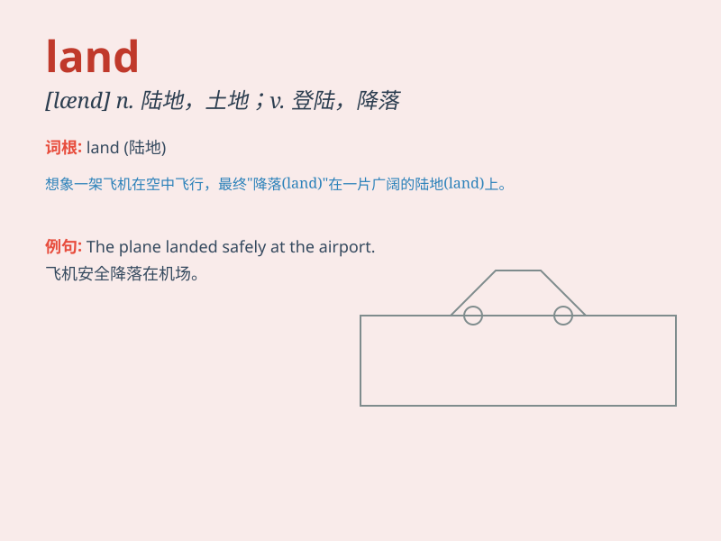

## land

**英音:** _[lænd]_ **美音:** _[lænd]_

**译义:**
*n.陆地,(书面语)国家、国土,地带,[复数]地产,田产vi.靠岸,登陆,登岸,到达vt.使上岸,使登陆,使到达,使处于*

### 短语

+ **land on:** _降落在；落到......上_

+ **land up:** _最终到达；最终处于_

+ **land in:** _使陷入（困境）_

+ **land ownership:** _土地所有权_

+ **land resources:** _土地资源_

### 例句

#### 例句1

> **The plane will land at the airport in half an hour.**

**中文翻译:** 飞机将在半小时后在机场降落。

**单词释义:** 降落

#### 例句2

> **He finally landed a good job after months of searching.**

**中文翻译:** 经过数月的寻找，他终于找到了一份好工作。

**单词释义:** 获得，得到

#### 例句3

> **The fisherman landed a big fish.**

**中文翻译:** 渔夫捕到了一条大鱼。

**单词释义:** 捕获

### 背诵小故事

> A brave adventurer was lost at sea. After many days, he finally saw
land. He jumped for joy as it meant safety and a new beginning. Land was
his hope and salvation.

**一位勇敢的探险家在海上迷失了方向。许多天后，他终于看到了陆地。他高兴得跳了起来，因为陆地意味着安全和新的开始。陆地是他的希望和救赎。**

### 图义

