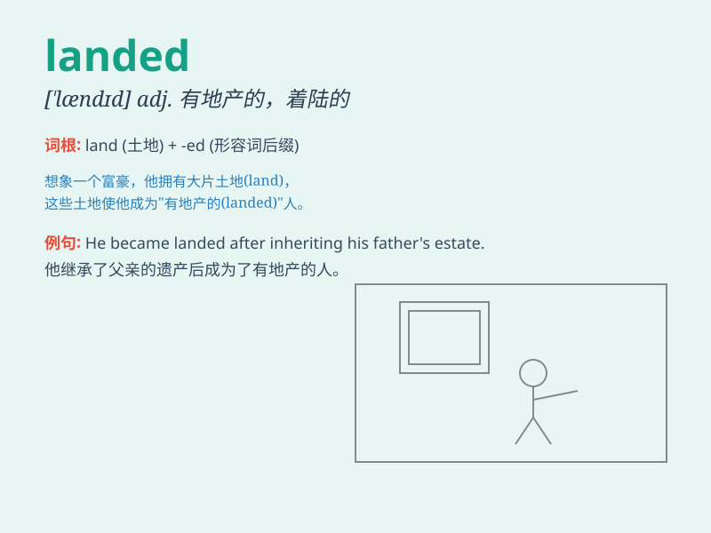

## landed

**英音:** _[\'lændɪd]_ **美音:** _[\'lændɪd]_

**译义:** *adj.拥有土地的,有田地的*

### 短语

+ **landed estate:** _地产；不动产_

+ **landed gentry:** _拥有地产的绅士阶层_

+ **landed property:** _地产；土地财产_

+ **landed cost:** _到岸成本；上岸成本_

+ **landed immigrant:** _落地移民；已入境移民_

### 例句

#### 例句1

> **The plane landed safely at the airport.**

**中文翻译:** 飞机安全地在机场降落。

**单词释义:** 降落（动词过去式，指飞机从空中到达地面）

#### 例句2

> **He landed a good job after graduation.**

**中文翻译:** 毕业后他找到了一份好工作。

**单词释义:** 获得，得到（动词过去式，指成功获取某物）

#### 例句3

> **The fish landed on the shore.**

**中文翻译:** 这条鱼落在了岸边。

**单词释义:** 落在（动词过去式，指物体从一处移动到另一处并停止）

### 背诵小故事

> A brave astronaut landed on a mysterious planet. After a long journey
through space, he safely touched the ground. The moment he landed, he
knew an amazing adventure was about to begin.

**一位勇敢的宇航员在一个神秘的星球上着陆。经过漫长的太空之旅，他安全地触地。在他着陆的那一刻，他知道一场奇妙的冒险即将开始。**

### 图义

