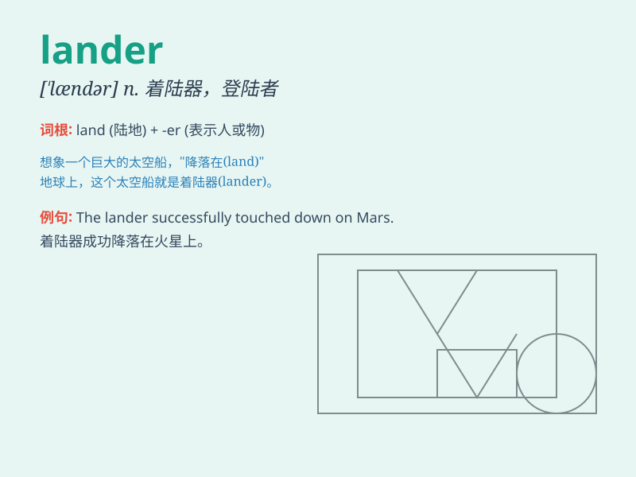

## lander

**英音:** _[\'lændə]_ **美音:** _[\'lændɚ]_

**译义:** *n.登陆车,着陆者,住在陆地上的人*

### 短语

+ **lunar lander:** _月球着陆器_

+ **soft lander:** _软着陆器_

+ **probe lander:** _探测器着陆器_

+ **autonomous lander:** _自主着陆器_

+ **space lander:** _太空着陆器_

### 例句

#### 例句1

> **The lander successfully touched down on the moon\'s surface.**

**中文翻译:** 着陆器成功地在月球表面着陆。

**单词释义:** 着陆器

#### 例句2

> **The new lander is equipped with advanced technology.**

**中文翻译:** 新的着陆器配备了先进的技术。

**单词释义:** 着陆器

#### 例句3

> **Scientists are closely monitoring the data sent by the
lander.**

**中文翻译:** 科学家们正在密切监测着陆器发送的数据。

**单词释义:** 着陆器

### 背诵小故事

>
想象一下，在遥远的星球上，有一个勇敢的探险家。他驾驶着特殊的飞船成功着陆，人们称他为\'lander\'。他的勇敢着陆为后续的探索开辟了道路。

**想象在星球上成功着陆的探险家被称为\'lander\'，他的着陆为探索开路**

### 图义

