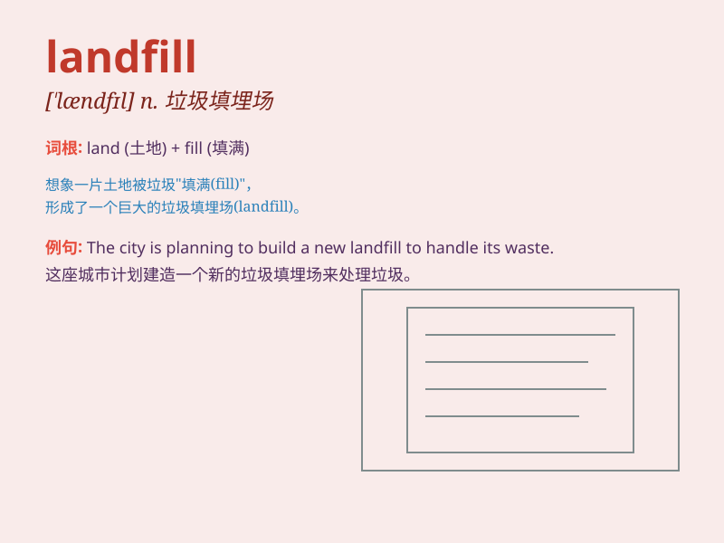

## landfill

**英音:** _[\'læn(d)fɪl]_ **美音:** _[\'lænd\'fɪl]_

**译义:** *n.垃圾掩埋法,垃圾*

### 短语

+ **landfill gas:** _垃圾填埋气_

+ **landfill site:** _垃圾填埋场_

+ **controlled landfill:** _受控填埋_

+ **sanitary landfill:** _卫生填埋_

+ **landfill operation:** _填埋作业_

### 例句

#### 例句1

> **The city is planning to expand the landfill to handle more
waste.**

**中文翻译:** 这个城市正计划扩大垃圾填埋场来处理更多的垃圾。

**单词释义:** 垃圾填埋场

#### 例句2

> **The smell from the landfill is unbearable in hot weather.**

**中文翻译:** 在炎热的天气里，垃圾填埋场散发的气味难以忍受。

**单词释义:** 垃圾填埋场

#### 例句3

> **We should reduce the amount of waste sent to the landfill.**

**中文翻译:** 我们应该减少送去垃圾填埋场的垃圾量。

**单词释义:** 垃圾填埋场

### 背诵小故事

> A group of friends went to a landfill. They saw mountains of garbage.
But one smart friend had an idea to recycle and make the landfill a
clean place. Remember, landfill is a place for garbage.

**一群朋友去了垃圾填埋场。他们看到堆积如山的垃圾。但一个聪明的朋友有了一个想法，要回收利用，把垃圾填埋场变成一个干净的地方。记住，landfill
就是垃圾填埋场。**

### 图义

