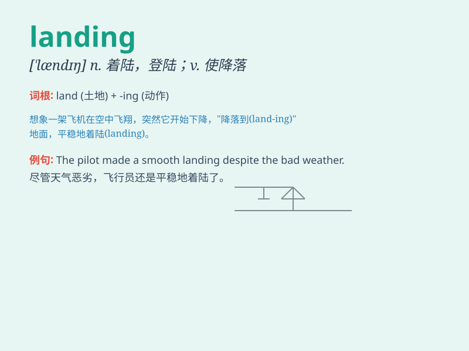

## landing

**英音:** _[\'lændɪŋ]_ **美音:** _[\'lændɪŋ]_

**译义:** *n.登陆,着陆,码头,楼梯平台,降落*

### 短语

+ **landing gear:** _起落架_

+ **landing page:** _着陆页；登录页面_

+ **landing stage:** _浮动码头；栈桥_

+ **landing strip:** _简易机场跑道_

+ **moon landing:** _登月_

### 例句

#### 例句1

> **The plane made a smooth landing on the runway.**

**中文翻译:** 飞机平稳地降落在跑道上。

**单词释义:** 着陆

#### 例句2

> **The landing of the spaceship was a major achievement.**

**中文翻译:** 宇宙飞船的着陆是一项重大成就。

**单词释义:** 着陆

#### 例句3

> **The staircase has a wide landing at the top.**

**中文翻译:** 楼梯的顶部有一个宽阔的平台。

**单词释义:** 平台

### 背诵小故事

> A brave pilot was flying a plane. Due to bad weather, the landing was
very difficult. But with his excellent skills, he finally made a safe
landing on the runway.

**一位勇敢的飞行员正在驾驶飞机。由于恶劣天气，着陆非常困难。但凭借他出色的技能，他最终在跑道上安全着陆。**

### 图义

