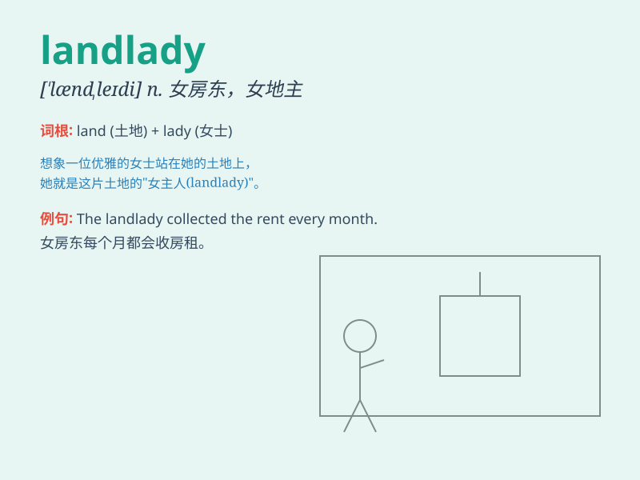

## landlady

**英音:** _[\'læn(d)leɪdɪ]_ **美音:** _[\'lændledi]_

**译义:** *n.女房东,女地主,(旅馆等的)老板娘*

### 短语

+ **a kind landlady:** _一位和善的女房东_

+ **the local landlady:** _当地的女房东_

+ **landlady\'s rules:** _女房东的规定_

+ **meet the landlady:** _见女房东_

+ **landlady\'s complaint:** _女房东的抱怨_

### 例句

#### 例句1

> **The landlady was very friendly and helpful.**

**中文翻译:** 女房东非常友好和乐于助人。

**单词释义:** 女房东

#### 例句2

> **I paid the rent to the landlady on the first of every month.**

**中文翻译:** 我每个月的一号把房租付给女房东。

**单词释义:** 女房东

#### 例句3

> **The landlady came to inspect the apartment regularly.**

**中文翻译:** 女房东定期来检查公寓。

**单词释义:** 女房东

### 背诵小故事

> A poor traveler was lost and tired. He knocked on a door and a kind
woman opened it. She owned the house and was the landlady. She gave him
a room and food. The traveler was grateful.

**一个可怜的旅行者迷路又疲惫。他敲了一扇门，一位善良的女士开了门。她拥有这所房子，是女房东。她给了他一个房间和食物。旅行者很感激。**

### 图义

