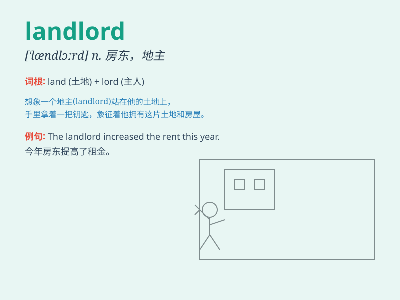

## landlord

**英音:** _[\'læn(d)lɔːd]_ **美音:** _[\'lændlɔrd]_

**译义:** *n.房东,地主,(旅馆等的)老板*

### 短语

+ **absentee landlord:** _在外房东，在外地主_

+ **rack-renting landlord:** _高额收租的房东_

+ **landlord insurance:** _房东保险_

+ **landlord tenant law:** _房东租户法_

+ **greedy landlord:** _贪婪的房东_

### 例句

#### 例句1

> **The landlord raised the rent by 20% this year.**

**中文翻译:** 房东今年把租金提高了20%。

**单词释义:** 房东

#### 例句2

> **We had a dispute with the landlord over the deposit.**

**中文翻译:** 我们因押金问题与房东发生争执。

**单词释义:** 房东

#### 例句3

> **The landlord is responsible for maintaining the property.**

**中文翻译:** 房东负责维护财产。

**单词释义:** 房东

### 背诵小故事

> A man named Tom owned a big house and some land. He rented the rooms
to others and collected money. So, Tom was a landlord.

**一个叫汤姆的男人拥有一座大房子和一些土地。他把房间租给别人并收租金。所以，汤姆就是一个房东。**

### 图义

