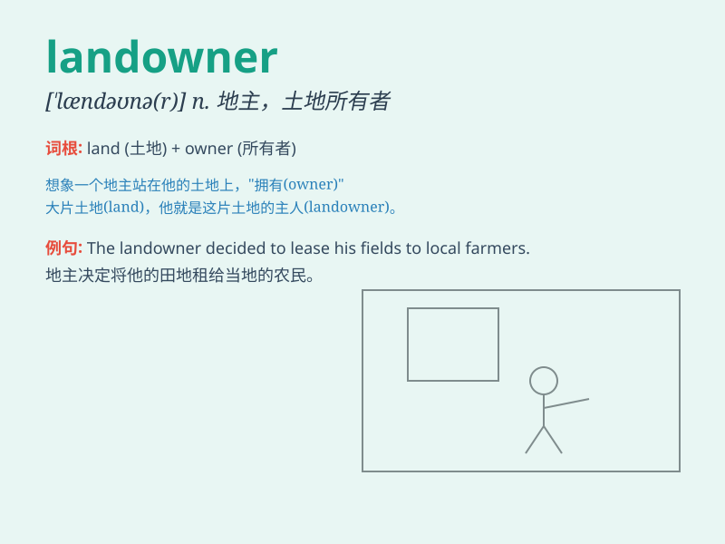

## landowner

**英音:** _[\'lændəʊnə]_ **美音:** _[\'lændonɚ]_

**译义:** *n.地主,土地所有者*

### 短语

+ **wealthy landowner:** _富有的地主_

+ **local landowner:** _当地的地主_

+ **prominent landowner:** _杰出的地主_

+ **landowner\'s rights:** _地主的权利_

+ **absentee landowner:** _在外的地主_

### 例句

#### 例句1

> **The landowner decided to sell his vast estate.**

**中文翻译:** 地主决定卖掉他的大片地产。

**单词释义:** 地主

#### 例句2

> **The landowner was notorious for his harsh treatment of
tenants.**

**中文翻译:** 这位地主因虐待佃户而臭名昭著。

**单词释义:** 地主

#### 例句3

> **The new law aims to protect the rights of landowners.**

**中文翻译:** 新法律旨在保护土地所有者的权利。

**单词释义:** 土地所有者

### 背诵小故事

> Once upon a time, there was a rich man. He had a lot of land and was
known as the landowner. People worked on his land and he collected rent.
One day, he decided to build a big house on his land to show his wealth.

**从前，有一个富人。他拥有很多土地，被称为地主。人们在他的土地上劳作，而他收取租金。有一天，他决定在他的土地上建一座大房子来彰显他的财富。**

### 图义

