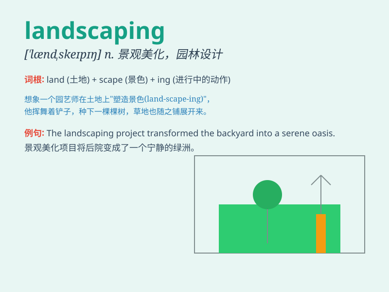

## landscaping

**英音:** _[ˈlændskeɪpɪŋ]_ **美音:** _[ˈlændskeɪpɪŋ]_

**译义:** *n.景观美化*

### 短语

+ **landscaping design:** _景观设计_

+ **landscaping project:** _景观工程_

+ **professional landscaping:** _专业的景观美化_

+ **landscaping service:** _景观美化服务_

+ **urban landscaping:** _城市景观美化_

### 例句

#### 例句1

> **The landscaping of this park is truly magnificent.**

**中文翻译:** 这个公园的景观确实很宏伟。

**单词释义:** 景观美化

#### 例句2

> **They spent a lot of money on landscaping their garden.**

**中文翻译:** 他们花了很多钱来美化花园。

**单词释义:** 景观美化

#### 例句3

> **Professional landscaping can increase the value of your
property.**

**中文翻译:** 专业的园林绿化可以增加您的财产的价值。

**单词释义:** 景观美化

### 背诵小故事

> A man loved nature and decided to start landscaping. He planted
beautiful flowers, trimmed the grass, and placed rocks to create a
charming garden. His hard work in landscaping made the place a paradise.

**一个男人热爱大自然，决定开始搞景观美化。他种了美丽的花，修剪了草坪，放置了石头，打造出一个迷人的花园。他在景观美化方面的辛勤工作让这个地方变成了天堂。**

### 图义

