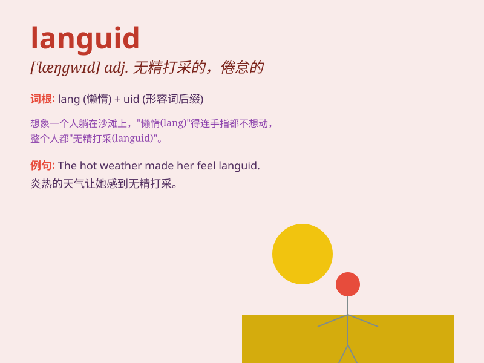

## languid

**英音:** _[ˈlæŋɡwɪd]_ **美音:** _[ˈlæŋɡwɪd]_

**译义:** *adj.疲倦的,无力的,没精打采的*

### 短语

+ **languid manner:** _慵懒的举止_

+ **languid movement:** _迟缓的动作_

+ **languid pace:** _缓慢的步伐_

+ **languid look:** _无精打采的神情_

+ **languid mood:** _倦怠的情绪_

### 例句

#### 例句1

> **She moved with a languid grace.**

**中文翻译:** 她的动作带着慵懒的优雅。

**单词释义:** 慵懒的；慢悠悠的

#### 例句2

> **The hot weather made him feel languid.**

**中文翻译:** 炎热的天气让他感到无精打采。

**单词释义:** 无精打采的；没精打采的

#### 例句3

> **His languid manner suggested a lack of interest.**

**中文翻译:** 他慵懒的态度表明他缺乏兴趣。

**单词释义:** 懒洋洋的；不积极的

### 背诵小故事

> A tired traveler was walking along a road in a hot summer day. His
steps were slow and his movements were languid. He needed to find a
place to rest and regain his energy.

**在一个炎热的夏日，一位疲惫的旅行者沿着道路行走。他的步伐缓慢，动作无力，显得无精打采。他需要找个地方休息，恢复精力。**

### 图义

