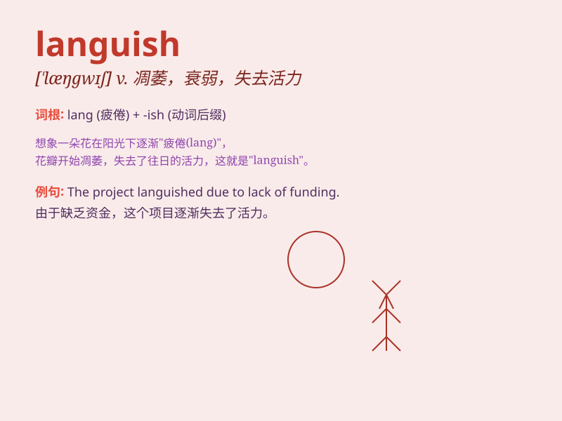

## languish

**英音:** _[\'læŋgwɪʃ]_ **美音:** _[\'læŋɡwɪʃ]_

**译义:** *vi.憔悴,凋萎,衰退,苦思*

### 短语

+ **languish in prison:** _在狱中受苦_

+ **languish for love:** _因爱而憔悴_

+ **languish under oppression:** _在压迫下受苦_

+ **languish in poverty:** _在贫困中煎熬_

+ **languish without hope:** _在无望中消沉_

### 例句

#### 例句1

> **The flowers languished without water.**

**中文翻译:** 没有水，花儿就枯萎了。

**单词释义:** 枯萎；憔悴

#### 例句2

> **He languished in prison for years.**

**中文翻译:** 他在监狱里度过了多年的痛苦时光。

**单词释义:** 受苦；受折磨

#### 例句3

> **The project has been languishing for months.**

**中文翻译:** 该项目已经停滞数月。

**单词释义:** 停滞；变得衰弱

### 背诵小故事

> A beautiful flower was planted in a dark corner. Without sunlight and
care, it began to languish. It lost its vitality and color, just like
someone feeling weak and sad.

**一朵美丽的花被种在黑暗的角落。由于没有阳光和照料，它开始变得憔悴。它失去了活力和颜色，就像某人感到虚弱和悲伤。**

### 图义

