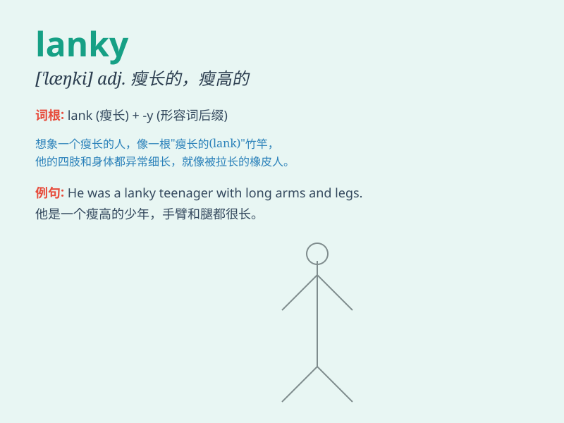

## lanky

**英音:** _[\'læŋkɪ]_ **美音:** _[\'læŋki]_

**译义:** *adj.瘦长的*

### 短语

+ **lanky figure:** _瘦长的身材_

+ **lanky teenager:** _瘦高的青少年_

+ **lanky limbs:** _瘦长的四肢_

+ **lanky build:** _瘦长的体型_

+ **lanky frame:** _瘦长的框架_

### 例句

#### 例句1

> **The lanky teenager towered over his classmates.**

**中文翻译:** 这个瘦长的少年比他的同学还要高大。

**单词释义:** 瘦高的

#### 例句2

> **He moved in a lanky, awkward gait.**

**中文翻译:** 他的步态瘦长而笨拙。

**单词释义:** 瘦长的

#### 例句3

> **The lanky basketball player had an advantage in reaching for
rebounds.**

**中文翻译:** 这位瘦长的篮球运动员在抢篮板方面具有优势。

**单词释义:** 瘦高的

### 背诵小故事

> Once upon a time, there was a lanky giraffe. It had very long and
thin legs. It could reach the highest leaves easily. People used
\'lanky\' to describe its tall and thin figure.

**从前，有一只瘦长的长颈鹿。它的腿又长又细。它能够轻松够到最高的树叶。人们用'lanky'来形容它又高又瘦的身形。**

### 图义

