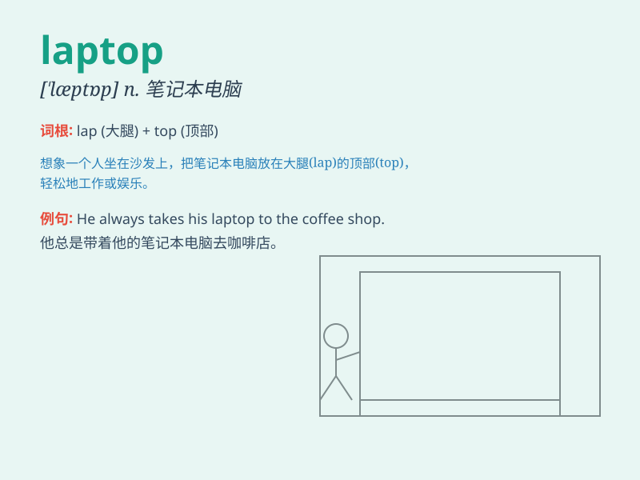

## laptop

**英音:** _[\'læptɒp]_ **美音:** _[\'læptɑp]_

**译义:** *膝上型电脑*

### 短语

+ **laptop computer:** _笔记本电脑_

+ **laptop bag:** _笔记本电脑包_

+ **laptop screen:** _笔记本电脑屏幕_

+ **laptop battery:** _笔记本电脑电池_

+ **laptop charger:** _笔记本电脑充电器_

### 例句

#### 例句1

> **I use my laptop to work from home.**

**中文翻译:** 我使用笔记本电脑在家工作。

**单词释义:** 笔记本电脑

#### 例句2

> **She carried her laptop in a stylish bag.**

**中文翻译:** 她把笔记本电脑装在一个时尚的包里。

**单词释义:** 笔记本电脑

#### 例句3

> **The new laptop has a high-resolution screen.**

**中文翻译:** 新笔记本电脑配备高分辨率屏幕。

**单词释义:** 笔记本电脑

### 背诵小故事

> One day, I was on a train and saw a man working efficiently on a
portable computer. I asked what it was and he said, \'This is a laptop.
It\'s like a small desk you can carry anywhere!\'

**有一天，我在火车上看到一个人高效地在一台便携式电脑上工作。我问这是什么，他说：'这是一台笔记本电脑。它就像一个你可以随身携带的小桌子！'**

### 图义

