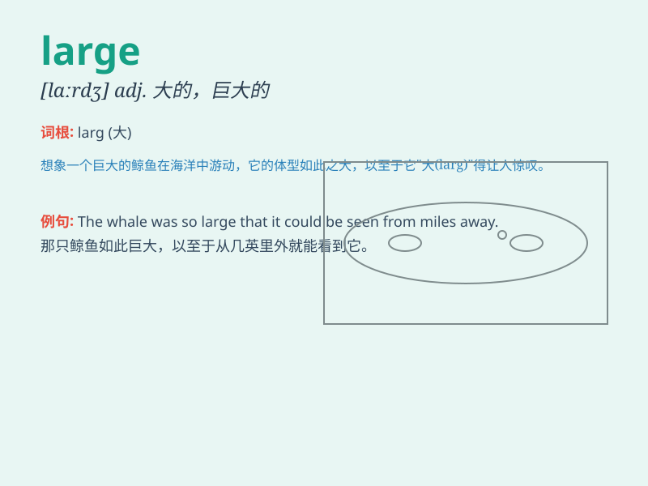

## large

**英音:** _[lɑːdʒ]_ **美音:** _[lɑrdʒ]_

**译义:**
*adj.大的,巨大的,宽大的,夸大的adv.大大地,夸大地,顺风地n.大*

### 短语

+ **large number:** _大量；众多_

+ **large scale:** _大规模；大尺度_

+ **by and large:** _总的来说；大体上_

+ **at large:** _逍遥法外；未被捕获_

+ **large amount:** _大量；巨额_

### 例句

#### 例句1

> **The room is very large.**

**中文翻译:** 房间很大。

**单词释义:** 大的

#### 例句2

> **She has a large family.**

**中文翻译:** 她有一个大家庭。

**单词释义:** 大的；规模大的

#### 例句3

> **He made a large profit from the business.**

**中文翻译:** 他从这项生意中获得了巨额利润。

**单词释义:** 巨大的；大量的

### 背诵小故事

> A little mouse dreams of having a large piece of cheese. One day, it
finds a huge cheese in a mysterious cave. The mouse is so happy because
the cheese is really large.

**一只小老鼠梦想拥有一大块奶酪。有一天，它在一个神秘的洞穴里发现了一块巨大的奶酪。老鼠非常高兴，因为这块奶酪真的很大。**

### 图义

