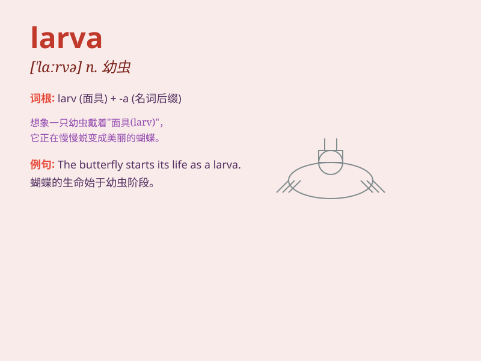

## larva

**英音:** _[\'lɑːvə]_ **美音:** _[\'lɑrvə]_

**译义:** *n.幼虫*

### 短语

+ **larva stage:** _幼虫阶段_

+ **insect larva:** _昆虫幼虫_

+ **larva development:** _幼虫发育_

+ **larva metamorphosis:** _幼虫变态_

+ **marine larva:** _海洋幼虫_

### 例句

#### 例句1

> **The larva of the butterfly feeds on leaves.**

**中文翻译:** 蝴蝶的幼虫以树叶为食。

**单词释义:** 幼虫

#### 例句2

> **The scientist is studying the growth process of the larva.**

**中文翻译:** 科学家正在研究幼虫的生长过程。

**单词释义:** 幼虫

#### 例句3

> **Many insects have a distinct larva stage in their life cycle.**

**中文翻译:** 许多昆虫在其生命周期中有一个独特的幼虫阶段。

**单词释义:** 幼虫

### 背诵小故事

> Imagine a little bug in a forest. It\'s not a grown-up insect yet.
This young form is called a larva. The larva crawls around, eating and
growing, waiting to become a beautiful butterfly one day.

**想象森林里有一只小虫子。它还不是成年的昆虫。这种幼小的形态就被称为幼虫。幼虫到处爬，吃吃长个，等待有一天变成美丽的蝴蝶。**

### 图义

