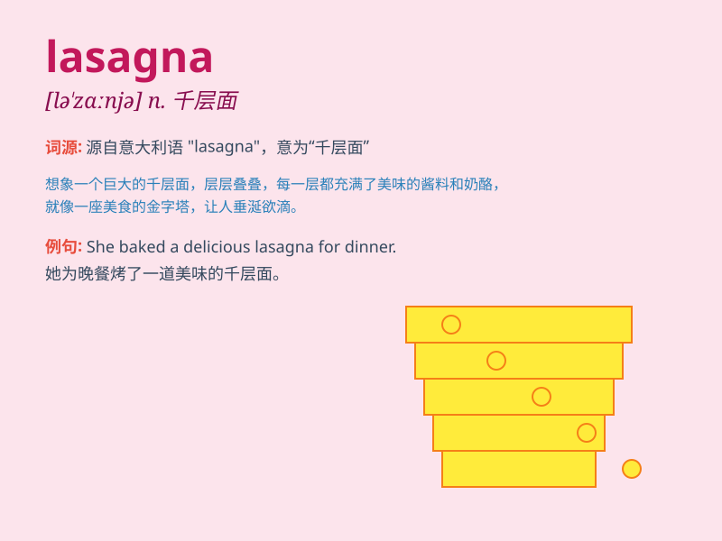

## lasagna

**英音:** _[ləˈzænjə]_ **美音:** _[ləˈzænjə]_

**译义:** *n. 千层面（一种意大利宽面条）*

### 短语

+ **beef lasagna:** _牛肉千层面_

+ **vegetarian lasagna:** _素食千层面_

+ **lasagna sheets:** _千层面皮_

+ **make lasagna:** _制作千层面_

+ **lasagna dinner:** _千层面晚餐_

### 例句

#### 例句1

> **I love the taste of lasagna with layers of cheese and pasta.**

**中文翻译:** 我喜欢有层层奶酪和意面的千层面的味道。

**单词释义:** 千层面

#### 例句2

> **She spent hours making lasagna for the dinner party.**

**中文翻译:** 她花了几个小时为晚宴做千层面。

**单词释义:** 千层面

#### 例句3

> **The lasagna in this restaurant is famous for its rich flavor.**

**中文翻译:** 这家餐厅的千层面因其浓郁的味道而出名。

**单词释义:** 千层面

### 背诵小故事

> One day, Tom was invited to a party. When he arrived, he saw a huge
plate of lasagna on the table. It looked so delicious with layers of
pasta, cheese, and meat. Tom couldn\'t wait to taste it.

**有一天，汤姆被邀请去参加一个聚会。当他到达时，他看到桌子上有一大盘千层面。它看起来太美味了，有着层层的意面、奶酪和肉。汤姆迫不及待地想尝尝。**

### 图义

