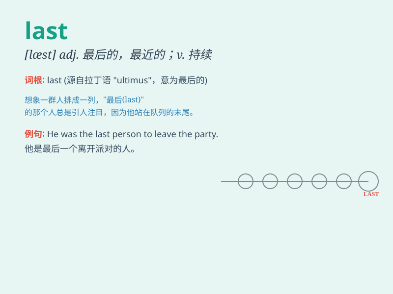

## last

**英音:** _[lɑːst]_ **美音:** _[læst]_

**译义:**
*adj.最后的,临终的,末尾的,最近的,结论性的vi.持续,支持,维持vt.使维持,楦adv.最后,后来n.最后,末尾,临终,鞋楦头*

### 短语

+ **last but not least:** _最后但同样重要的_

+ **the last straw:** _最后一根稻草；使人无法忍受的最后一击_

+ **at last:** _终于；最终_

+ **last for:** _持续；维持_

+ **last name:** _姓_

### 例句

#### 例句1

> **The last time I saw him was at the party.**

**中文翻译:** 我最后一次见到他是在聚会上。

**单词释义:** 上一次；最后的

#### 例句2

> **This is the last book in the series.**

**中文翻译:** 这是该系列的最后一本书。

**单词释义:** 最后的

#### 例句3

> **He lasted only five minutes in the race.**

**中文翻译:** 他在比赛中只坚持了五分钟。

**单词释义:** 持续；维持

### 背诵小故事

> A brave knight was in a fierce battle. It seemed like it would never
end, but at last, he emerged victorious. \'At last\' means finally or in
the end. The knight\'s perseverance paid off at the conclusion of the
fight.

**一位勇敢的骑士正在进行一场激烈的战斗。这场战斗似乎永远不会结束，但最后，他取得了胜利。'at
last'意思是最终或终于。骑士的坚持在战斗的结尾得到了回报。**

### 图义

