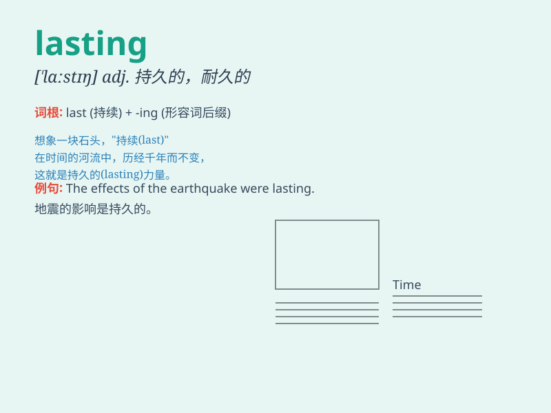

## lasting

**英音:** _[\'lɑːstɪŋ]_ **美音:** _[\'læstɪŋ]_

**译义:**
*adj.持久的,永久的,永恒的,耐久的n.厚实斜纹织物(作鞋帮等用)*

### 短语

+ **lasting impression:** _持久的印象_

+ **lasting friendship:** _持久的友谊_

+ **lasting value:** _持久的价值_

+ **lasting peace:** _持久的和平_

+ **lasting effect:** _持久的影响_

### 例句

#### 例句1

> **The painting is a lasting masterpiece.**

**中文翻译:** 这幅画是一幅不朽的杰作。

**单词释义:** 持久的；永恒的

#### 例句2

> **Their friendship has a lasting bond.**

**中文翻译:** 他们的友谊历久不衰。

**单词释义:** 持久的；永恒的

#### 例句3

> **The event left a lasting impression on me.**

**中文翻译:** 这次活动给我留下了深刻的印象。

**单词释义:** 持久的；永恒的

### 背诵小故事

> A painter spent months creating a masterpiece. Years passed, and the
painting remained beautiful and untouched. Its charm was lasting, just
like a never-ending song. People always admired it.

**一位画家花了数月创作了一幅杰作。多年过去了，这幅画依然美丽如初、完好无损。它的魅力是持久的，就像一首永不停息的歌。人们总是对它赞赏有加。**

### 图义

