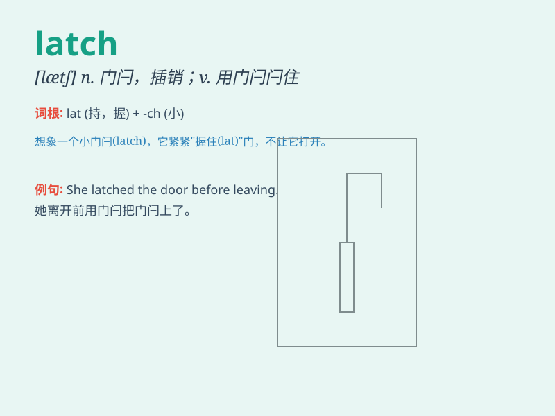

## latch

**英音:** _[lætʃ]_ **美音:** _[lætʃ]_

**译义:** *n.门插销v.闭锁*

### 短语

+ **latch on:** _理解；明白；抓住_

+ **latch off:** _关闭；闩住_

+ **latch onto:** _获得；占有；明白_

+ **door latch:** _门闩_

+ **latch key:** _弹簧锁钥匙_

### 例句

#### 例句1

> **The door won\'t latch properly.**

**中文翻译:** 门无法正确锁上。

**单词释义:** 闩上；锁住

#### 例句2

> **She latched onto his arm and wouldn\'t let go.**

**中文翻译:** 她抓住他的手臂，不肯放开。

**单词释义:** 抓住；紧握

#### 例句3

> **The child latched onto the new toy immediately.**

**中文翻译:** 孩子立刻就喜欢上了这个新玩具。

**单词释义:** 对\...产生强烈兴趣；紧紧抓住

### 背诵小故事

> A little mouse was trying to find food in a barn. It saw a latch on a
door. When it pushed the latch, the door opened and it happily entered.
The latch was the key to get inside.

**一只小老鼠在谷仓里找食物。它看到一扇门上有个门闩。当它推开门闩时，门开了，它高兴地进去了。门闩就是进去的关键。**

### 图义

